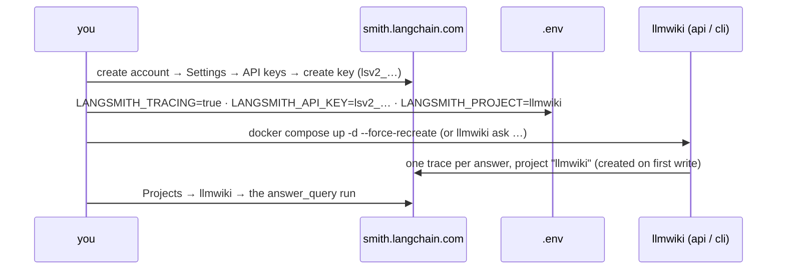
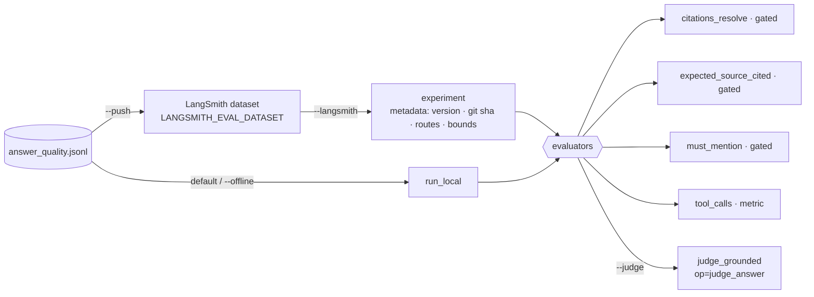
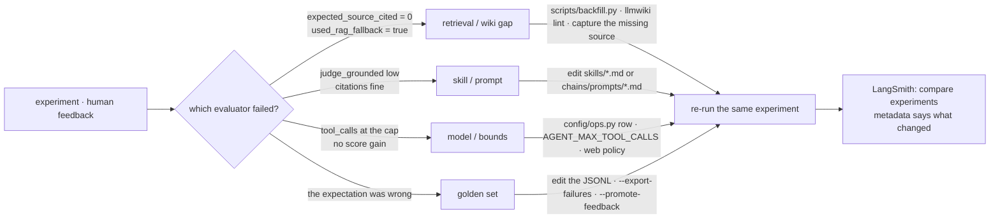

# llmwiki — Technical Document

**Audience:** an engineer who needs to support, extend, fix, or test this
repository, without having read the design doc or implementation plan first.
**Scope:** the codebase as it exists on disk today (Phase 0, plus plan II
§19's R1–R5: multi-provider LLM routing and query-agent skill invocation, plus
Phase 1: capture channels, local-LLM provider entries, and — since 2026-09-16 —
the LangGraph query graph, external search and the LangSmith evaluation loop,
plan §20).
This document describes *implemented behaviour*. Where the roadmap differs
from today's code, that is called out explicitly rather than blended in.

**Primary sources this document distills**, and where to go for more:

| Document | What it's for |
|---|---|
| `docs/llmwiki-KB-design_v1.4.md` | Why the system is shaped this way — architecture rationale, phase plan. Read before making a *design* decision. |
| `docs/implement-plan.md` | The implementation plan. Part I: Phase 0 (executed). Part II: the packaging/extraction plan (mostly not yet executed — see §11) plus the Phase 1 behaviour changes (§19–§21). |
| `docs/HISTORY.md` | Chronological log of every change, bug, and deviation. The ground truth for "why is this line like this". |
| **This document** | The map: which class calls which, how to extend each seam, and the full API surface. Optimized for "I need to change X" and "what does Y expose". |

---

## 1. System Overview

llmwiki is a **research knowledge base**: sources you capture (PDF files,
blog/article URLs, YouTube videos, pasted text and text files — §3.1.1) are
stored immutably, then an LLM
llmwiki is a **research knowledge base**: sources you capture (PDF files,
blog/article URLs, YouTube videos, pasted text and text files — §3.1.1) are
stored immutably, then an LLM
incrementally compiles them into an interlinked markdown wiki. A query agent
answers questions from that wiki first, falling back to raw vector search,
and every citation it returns is verified to resolve back to a real captured
source. The compiler is deliberately non-agentic (fixed stages, fixed
prompts); the query agent gained one narrow piece of genuine agentic
behaviour in R5 — choosing, and chaining, among a discoverable catalog of
skills before it answers (§2.4, §3.3).

```
Capture → raw/ (object storage) → Extract → Chunk + Embed → Vector Store
                                          └→ Incremental Wiki Compiler → wiki/
Query Agent reads wiki/ first, falls back to Vector Store, answers with citations.
```

Three things make the codebase tractable to work in:

1. **A strict, mechanically-enforced layer ladder** (§2) — you cannot import
   "upward" and have the test suite pass.
2. **One function surface, three transports** — `tools.py` contains the
   entire business API; the REST routes, the MCP tools, and the CLI are thin
   serialization shims over the exact same functions (§3.4, §6).
3. **Everything that touches the network is a `Protocol` with a real adapter
   and a fake** — `ObjectStore`, `VectorStore`, `Embedder`, `LLMClient`. Tests
   and `--offline` runs swap in the fakes; nothing else changes (§2.3).

---

## 2. Module Map and Layering

### 2.1 The layer ladder

`src/llmwiki/` is organized as directories, each one a "layer". Dependencies
point **inward/downward only**. This is not a convention — it is enforced by
`tests/unit/test_layering.py`, which walks the AST of every module (including
function-local imports) and fails the build on a forbidden edge. If you add
an import that violates the ladder, **move the code**, don't widen the rule
— `CLAUDE.md` names this test load-bearing.

```
L0  models/                (pure pydantic schemas, zero I/O, imports nothing else in llmwiki)
     │
L1  storage/  extractors/  embedding/  vector/  llm/  websearch/   (adapters — each Protocol-based, siblings, never import each other)
     │
L1* chains/                (prompt CONTENT + a cached file loader — no domain logic; §2.4)
     │
L2  wiki/     agent/                                     (domain logic — compiler, page I/O, query graph + tools + skills + judge; §2.4, §3.3)
     │
L3  pipeline/                                             (orchestrates extract → chunk → embed → compile)
     │
L4  tools.py   eval/                                       (the entire public function surface — the "brain"; eval/ is a peer that only calls tools.py; §10)
     │
L5  api/  mcp/  cli.py  channels/                          (transports — validate input, call tools.py, serialize)
```

Two things live entirely **outside** `src/llmwiki/` and are not part of the
installed package at all: repo-root `config/` (§5.6) and repo-root `skills/`
(§2.4, §5.8). Neither is a "layer" in the ladder above — `test_layering.py`
and `test_package_boundaries.py`-style guards do not scan them.

Two allowed exceptions, both serialization not logic: `api/` and `cli.py` may
import `wiki.pages.render_page` to render a page as markdown text, and
`cli.py` imports `factory` (it is an entry point, not a domain layer). See
`ALLOWED_EXCEPTIONS` in `test_layering.py` for the exact list — do not add to
it without also adding the reason there.

`factory.py` and `config.py` sit **outside** the ladder deliberately:
`config.py` is the only module allowed to read `os.environ` (besides the
routing-config loader, §5.6), and `factory.py` is the only place concrete
adapters (`boto3`, `anthropic`, `pymupdf`, …) get imported — always
function-locally, so an offline run never even imports them. Only `tools.py`
and the entry points (`cli.py`) call `factory`; domain classes (`Compiler`,
`QueryAgent`, `IngestPipeline`) take already-built protocol instances in
their constructors and never call the factory themselves. This is what makes
them testable with a spy store or a scripted LLM.

### 2.2 Directory-by-directory

| Path | Layer | Responsibility |
|---|---|---|
| `models/` | L0 | Pydantic schemas only: `source.py`, `chunk.py`, `page.py`, `plan.py`. No I/O. Phase 2 (§12) added `GENERAL_DOMAIN`, `ImageInput`, `DomainAssignment`, `Domain`/`DomainRegistry`, `CostKind`, `SynthesisResult`, `WorkerStatus`, `AlertState` and `domain`/`dense_score`/`cost_usd` fields on the existing shapes. |
| `storage/` | L1 | `ObjectStore` protocol (`base.py`), `LocalObjectStore`, `R2ObjectStore`, and `layout.py` (the *only* module that builds object keys). |
| `extractors/` | L1 | `Extractor` protocol + modality detection (`base.py`), and one module per modality: `pdf.py`, `web.py`, `youtube.py`, `text.py`, `image.py` (Phase 2). Extractors are LLM-free: `pdf.py`/`image.py` hand rendered pages to `pipeline/describe.py` (§12.4). |
| `embedding/` | L1 | `Embedder` protocol (`base.py`), `WorkersAIEmbedder`, `FakeEmbedder`. |
| `vector/` | L1 | `VectorStore` protocol (`base.py`, + `ensure_index` since Phase 2), `VectorizeStore`, `MemoryVectorStore`. |
| `lexical/` | L1 | Phase 2 (§12.2): `LexicalIndex` protocol (`base.py`, the same shape as `VectorStore`), `SqliteLexicalIndex` (FTS5, one file per index), `MemoryLexicalIndex` (BM25). |
| `rerank/` | L1 | Phase 2 (§12.2): `Reranker` protocol, `WorkersAIReranker` (`bge-reranker-base`), `FakeReranker`. |
| `notify/` | L1 | Phase 2 (§12.3): `Notifier` protocol, `LogNotifier`, `TelegramNotifier`, `FakeNotifier` — where cost alerts go. |
| `llm/` | L1 | `LLMClient` protocol (`base.py`) and, since Phase 2, the optional `VisionLLMClient` (`describe()`), `AnthropicLLM`, `LangChainLLM`, `FakeLLM`, the provider registry, pricing, the R1–R3 multi-provider router (`router.py`, `routing_config.py`) and `metering.py` (`MeteredLLM` + `collect_usage()`, query-side cost). `KNOWN_OPS` is ten ops since Phase 2 (§3.5, §12). |
| `websearch/` | L1 | `WebSearcher` protocol (`base.py`), `TavilyWebSearcher` (`langchain-tavily`, imported only when selected), `FakeWebSearcher`. The query graph's optional `search_web` tool backend (§3.3, §5.11). |
| `wiki/` | L2 | `compiler.py` (the incremental compiler), `pages.py` (read/write/parse), `gists.py` (the manifest + index — one per domain), `lint.py` (scheduled check, per domain). Phase 2 (§12): `domains.py` (registry, `DomainScope`, `resolve_scopes`), `router.py` (`DomainRouter`), `ledger.py` (`CostLedger`), `alerts.py` (`CostAlerts`, the hard cap), `synthesis.py` (the overview page). |
| `agent/` | L2 | `query.py` — `QueryAgent`: public surface (`search`, `answer`, `source_exists`) plus the helpers the graph reuses. `graph.py` — the LangGraph `StateGraph` behind `answer()` (§3.3). `toolkit.py` — the LangChain tools the loop may call and the policy gate. `retrieval.py` — Phase 2 (§12.2): the one dense/lexical/rerank seam every query goes through. `judge.py` — the eval-only groundedness grader. `skills.py` — `discover_skills()`, reads the repo-root `skills/` SKILL.md catalog. See §2.4. |
| `chains/` | L1/L2-adjacent | `prompts_loader.py` + `prompts/*.md` — the prompt templates: the compiler's four (always), `answer_query` (query agent when no `skills/` catalog is discovered), `agent_step` (the graph's tool decision), `judge_answer` (eval) and, since Phase 2, `route_domain_source`/`route_domain_query`, `describe_image`, `synthesize_domain`. **Not** the same thing as repo-root `skills/` — see §2.4. |
| `pipeline/` | L3 | `ingest.py` (`IngestPipeline` — capture/extract/describe/route/embed/compile orchestration), `chunker.py` (heading-aware text chunking). Phase 2 (§12): `worker.py` (`CompileWorker`, `domain_lock`, pending markers), `describe.py` (vision pages → markdown), `lexical_rebuild.py`. |
| `tools.py` | L4 | Every function any transport calls. This *is* the public Python API (§6.1). |
| `eval/` | L4 | `dataset.py` (golden-set JSONL ↔ LangSmith), `evaluators.py`, `run.py` (local runner + `langsmith.evaluate` wrapper), `feedback.py` (corrections → examples). A peer of `cli.py`: reaches the domain only through `tools.py`; `langsmith` imported function-locally. §10. |
| `api/` | L5 | `app.py` (FastAPI app + MCP mount + the worker's lifespan), `routes.py` (HTTP handlers), `dashboard.py` (Phase 2: the server-rendered usage page). |
| `mcp/` | L5 | `server.py` — the seven agent-facing MCP tools (six canonical + `list_domains` since Phase 2), same functions as `api/routes.py`. |
| `cli.py` | L5 | `llmwiki` console script (incl. `ask`, `feedback`, and since Phase 2 `domains`, `usage`, `worker`, `lexical rebuild`, `synthesize`). |
| `channels/` | L5 | Telegram and email webhook capture channels (Phase 1 A/B). |
| `factory.py` | outside ladder | Builds concrete adapters from `Settings`. Only `tools.py` and `cli.py` call it. |
| `config.py` | outside ladder | `Settings` (pydantic-settings) — the only module reading `.env`/`os.environ`, except `llm/routing_config.py` (§5.6). |

Repo-root `config/` (note: **not** `src/llmwiki/config.py`) is a separate,
uninstalled thing — see §5.6. Repo-root `skills/` (note: **not**
`src/llmwiki/chains/prompts/`) is the same kind of thing, for the query
agent's skill catalog — see §2.4 and §5.8.

### 2.3 The adapter pattern (why tests never touch the network)

Every external dependency is a `typing.Protocol`:

```python
# storage/base.py, extractors/base.py, embedding/base.py, vector/base.py, llm/base.py
class ObjectStore(Protocol): ...
class Extractor(Protocol): ...
class Embedder(Protocol): ...
class VectorStore(Protocol): ...
class LLMClient(Protocol): ...
```

`factory.py` maps `Settings` fields to concrete instances, with **function-local
imports of the concrete SDKs** (`boto3`, `anthropic`, `pymupdf`, `trafilatura`,
`youtube_transcript_api`) so importing `factory` itself never pulls one in.
Domain classes (`Compiler`, `QueryAgent`, `IngestPipeline`) are constructed
with already-built protocol instances — they never call `factory` themselves.
That is the seam tests exploit: pass a `MemoryVectorStore`, a
`LocalObjectStore`, a `FakeEmbedder`, a `FakeLLM` (or a scripted spy for any
of them) and you get the real control flow with zero network calls.

`--offline` (CLI flag, or `docker compose --profile offline`) sets four env
vars (`STORAGE_BACKEND=local`, `VECTOR_BACKEND=memory`,
`EMBEDDING_BACKEND=fake`, `LLM_PROVIDER=fake`) and, since the R1–R3 routing
feature landed, **also** points `LLMWIKI_PROVIDERS_CONFIG`/`LLMWIKI_OPS_CONFIG`
at a guaranteed-nonexistent path — otherwise a real `config/providers.py` in
the checkout would silently outrank `LLM_PROVIDER=fake` (see §5.6 and the
2026-09-06 `HISTORY.md` entry for the bug this fixed).

### 2.4 Agents, `chains/prompts/`, and `skills/` — three things with similar names

This codebase has exactly **two** things that ever call an LLM as part of
answering a request — the compiler and the query agent — and only one of
them is "agentic" in the tool-calling sense (since R5 for choosing a skill;
since Phase 1-D, 2026-09-16, for choosing evidence-gathering tools too). The rest of this section
exists because `chains/` and `skills/` look interchangeable at a glance
(both are directories of markdown files with YAML frontmatter) and are not:
they are consumed by different code, at different times, for different
reasons.

**0. What each agent actually is.**

| | `Compiler` (`wiki/compiler.py`) | `QueryAgent` (`agent/query.py`) |
|---|---|---|
| Called from | `IngestPipeline.process()` → `compile_source()` (§3.1) | `tools.answer()` (§3.3) |
| Shape | Five **fixed** stages, always in the same order (§3.2) | A LangGraph `StateGraph` (§3.3): one deterministic retrieval pass, then a **bounded** tool loop (Phase 1-D), then (R5) an optional skill-selection step, then generation, then citation resolution |
| LLM calls per run | Up to 4 (`summarize_source`, `plan_compile`, `create_page`\*, `patch_page`\*) | With `AGENT_MAX_TOOL_CALLS=0`: 1 (no `skills/` catalog) to `1 + MAX_SKILL_CHAIN` — exactly the pre-graph count. Loop on: `(n + 1)` cheap `agent_step` calls on top, `n ≤ AGENT_MAX_TOOL_CALLS` |
| Which prompt runs, decided by | **The Python source code.** Each stage's function body names its own `op=` and calls `load_prompt("<that literal name>")` — there is no branch, no choice, no model input into this decision | No catalog: the source code, identically. **Catalog present: the model** picks the skill (R5). **Loop on: the model** also picks which evidence tool to call next, from a set the code offers (§3.3) |
| Is this "agentic"? | **No, deliberately.** Design v1.4 §4.4/§4.8.2 requires the compiler to stay non-agentic — a model that could decide to re-plan, retry, or call something unexpected is exactly what would break the "compilation cost never grows with wiki size" guarantee `test_compiler_no_full_scan.py` enforces | **Only this one, and only inside code-enforced bounds.** It can choose a skill (R5) and, since Phase 1-D, call `search_wiki` / `search_chunks` / `get_page` (and `search_web` when policy offers it) up to `AGENT_MAX_TOOL_CALLS` times within one shared context budget. It cannot skip the wiki-first retrieval, exceed the cap, pick a tool the policy withholds, or cite anything outside `raw/` — §3.3 for the exact boundary |

\* `create_page`/`patch_page` run zero or more times, once per planned
operation (§3.2 step 4), not fixed at exactly one call.

**1. The original structure (still true for the compiler, and for the query
agent whenever no `skills/` catalog exists): `chains/prompts/*.md` is content,
not logic.**

`chains/prompts_loader.py:load_prompt(name)` is a cached file reader with one
job: given a literal string, return the body of `prompts/{name}.md`. It has
no opinion about *when* `name` should be `"plan_compile"` vs `"answer_query"`
— that decision is compiled into the Python call site itself:

```python
# wiki/compiler.py — always this literal string, every run, no exception
response = self.llm.complete(op="summarize_source",
                              system=load_prompt("summarize_source"), ...)

# agent/query.py, pre-R5 (and still today, whenever discover_skills() finds nothing)
response = self.llm.complete(op="answer_query",
                              system=load_prompt("answer_query"), ...)
```

R4 (2026-09-07) added `name`/`description` YAML frontmatter to all five files
so each is independently readable as an Agent Skill by an *external* harness
(Claude Code, the Claude Agent SDK, an MCP client) — but that changed nothing
about how *this codebase* uses them. `load_prompt()` still strips the
frontmatter and returns the body only, and every call site above is exactly
as fixed as it was before R4. **If you are adding a new compiler stage, you
are extending this fixed structure — see §5.3, not §5.8.**

**2. The new structure (R5, query agent only): `skills/*.md` is a catalog the
model chooses from, at request time.**

Repo-root `skills/` (a **different directory** from
`src/llmwiki/chains/prompts/` — see the warning in §2.2) holds the same kind
of SKILL.md-format files, but nothing in `agent/query.py` hardcodes which one
runs. Instead:

```
agent/skills.py:discover_skills(settings.agent_skills_dir)
    scans every *.md under the directory, at the START of every answer() call
    → dict[name, Skill(name, description, body, path)]     — an open set,
      not a fixed list of call sites; adding a skill = adding a file, no code change

agent/query.py:QueryAgent._select_skills(query, skills)
    shows the model the discovered {name: description} listing
    ONE forced-schema LLM call (op="answer_query", schema names the discovered
    names as an enum) → the model picks 1..MAX_SKILL_CHAIN of them, in order
    invalid/hallucinated choice → retry once → fall back to the fixed
    chains/prompts/answer_query.md skill (never a hard failure)

agent/query.py:QueryAgent._answer_with_skills(...)
    runs the chosen skill(s) in order: each is ONE more op="answer_query" call
    whose `system` is THAT skill's body (not chains/prompts/answer_query.md);
    step 2+ also receives step 1's output text appended to its prompt
```

The generation call's *shape* never changes —
`LLMClient.complete(op="answer_query", system=..., prompt=...)`, the same
signature the pre-R5 code always used. What changed is that `system` is no
longer always the literal return value of `load_prompt("answer_query")`; it
is now, when a catalog exists, whichever skill body the model picked for
*this specific question*. See §3.6 for how this fits together with *which
concrete `LLMClient` class* actually executes that call — the two decisions
(which text, which provider) are made by unrelated code and never see each
other.

| | `chains/prompts/*.md` | repo-root `skills/*.md` |
|---|---|---|
| Read by | `chains/prompts_loader.load_prompt(name)` | `agent/skills.py:discover_skills(dir)` |
| Used by | Compiler (always, all 4 stages) + query agent (only as the R5 fallback) | Query agent only (R5), when the directory has ≥1 valid file |
| Which file runs | Hardcoded per call site, in Python | Chosen by the model, per question, via a tool-call |
| Adding a new one | Requires a new `op=` value + a new call site (§5.3) | Drop a new `.md` file in `skills/` — **no code change** |
| Malformed file | N/A — `FileNotFoundError` if a hardcoded name is missing | Logged and **skipped**, not fatal (`agent/skills.py`) — the agent must keep answering even if one skill file is broken |
| Location | `src/llmwiki/chains/prompts/` — inside the installed package | Repo root `skills/` — outside `src/llmwiki/`, like `config/` (§5.6), not installed, not scanned by any layering test |
| Ships with (this repo) | `summarize_source.md`, `plan_compile.md`, `create_page.md`, `patch_page.md`, `answer_query.md` | `answer_query.md` (default, single-skill), `compare_concepts.md` |

**Gotchas worth knowing before touching either directory:**

- Every test in `tests/unit/` except `test_agent_skill_invocation.py` runs
  with `Settings.agent_skills_dir` pointed at a **guaranteed-absent**
  directory (`conftest.py`'s autouse `_isolate_agent_skills_dir` fixture). If
  you add a test that calls `QueryAgent.answer()` and expect skill selection
  to run, you must pass your own `agent_skills_dir=` — the default fixture
  will otherwise silently give you the fixed-prompt path.
- All skill-related LLM calls (the selection call and every chosen skill's
  generation call) are recorded under the single op label `"answer_query"` in
  the cost ledger — there is currently no way to tell, from
  `wiki/_meta/cost.jsonl` alone, how many of a given `answer_query` call's
  tokens were spent choosing a skill versus generating the answer. This was a
  deliberate scope decision (avoids a new `op=` value and the config/AST-guard
  churn that would come with one) — revisit if per-step cost visibility
  becomes important; `implement-plan.md` Part II §19.9 item 3 flags the related
  open question of LangSmith span granularity.
- `agent/skills.py` is in the `agent` layer (L2) — same `test_layering.py`
  rules as `agent/query.py` apply to it (may not import `api/mcp/cli/
  pipeline/tools/factory`).
- The compiler is **never** a consumer of `skills/` and is not expected to
  become one — see the "No, deliberately" row above. Do not wire
  `discover_skills()` into `wiki/compiler.py`. The same goes for the query
  graph's tools (`agent/toolkit.py`): they are the query agent's, not the
  compiler's.
- Every test in `tests/unit/` runs with `AGENT_MAX_TOOL_CALLS=0`
  (`conftest.py`'s `_isolate_query_tool_loop`, the third instance of the
  isolation-fixture pattern above), so the tool loop is never entered unless
  a test opts in with `settings.model_copy(update={"agent_max_tool_calls":
  n})` — `tests/unit/test_agent_graph.py` is where that happens.

---

## 3. End-to-End Workflows (class/file → class/file)

### 3.1 Ingest → Compile

Entry points: `POST /ingest` or `POST /upload` (`api/routes.py`), the MCP
tool `ingest_source`, or `llmwiki ingest` (`cli.py`). All three call into
`tools.py`. What they accept is one of three *inputs* covering five *source
kinds* — see §3.1.1.
`tools.py`. What they accept is one of three *inputs* covering five *source
kinds* — see §3.1.1.

```
api/routes.py:ingest()              ┐
mcp/server.py:ingest_source()       ├─► tools.py:ingest_source()  ──► IngestPipeline.capture()
cli.py (ingest command)             ┘        (or tools.ingest_now, which also runs process())

IngestPipeline.capture(url= | file= | text=)  [pipeline/ingest.py]
  ├─► IngestPipeline._content_hash()                           (validate exactly one input,
  │      storage.layout.content_hash_for_bytes / _for_url        then content-address it)
  ├─► ObjectStore.list(raw/{hash})  → duplicate?                (BEFORE any fetch; a prefix
  │                                                              list, since the slug half of
  │                                                              the id is not known yet)
  ├─► extractors.base.detect_modality                          (pick pdf/web/youtube/text)
  ├─► extractors.web.fetch / extractors.youtube.fetch_transcript  (URL sources only, at capture time)
  └─► ObjectStore.put()  → raw/{id}/original.*, raw/{id}/meta.json     (immutable, written once)
  returns SourceRef{source_id, status="queued"} immediately

--- background task (api) or synchronous continuation (CLI/MCP) ---

IngestPipeline.process(source_id)  [pipeline/ingest.py]
  ├─► IngestPipeline.extract()
  │     └─► extractors.base.get_extractor(modality).extract()   → ExtractedDoc
  │           (PdfExtractor / WebExtractor / YouTubeExtractor / TextExtractor)
  │         ObjectStore.put()  → raw/{id}/extracted.md
  │
  ├─► IngestPipeline._embed()
  │     ├─► pipeline.chunker.chunk_document(doc)                → list[Chunk]
  │     ├─► Embedder.embed([chunk texts])                        → vectors
  │     └─► VectorStore.upsert(chunks index, ...)
  │
  └─► Compiler.compile_source(doc)     [wiki/compiler.py]  — see §3.2
```

### 3.1.1 The five source kinds

`capture()` takes **exactly one** of three inputs — more than one, or none,
is a `ValueError` (a 422 over REST). Those three inputs cover five source
kinds, and which kind a source *is* is always **detected, never declared by
the caller**:

| Source kind | Input | Modality | Stored as | Extractor |
|---|---|---|---|---|
| PDF file | `file=` bytes (+ `filename`/`mime`) | `pdf` | `original.pdf` | `extractors/pdf.py` — text layer per page, `### Page N` markers; a scan with no text layer fails loudly (no OCR in Phase 0) |
| Blog / article URL | `url=` | `web` | `original.html` | `extractors/web.py` — trafilatura to markdown |
| YouTube URL | `url=` | `youtube` | `original.json` (the transcript) | `extractors/youtube.py` — timestamped `### HH:MM:SS` paragraphs |
| Pure text | `text=` | `text` | `original.txt` | `extractors/text.py` — decode + normalize |
| Text file | `file=` bytes (`.txt`/`.md`) | `text` | `original.txt`/`.md` | same as above |

**How the modality is decided** (`extractors/base.py:detect_modality`, ordered):

1. **URL shape wins first.** `youtube.py:is_youtube_url()` requires *both* a
   YouTube host and an extractable 11-character video id, so `/watch`,
   `youtu.be/`, `/shorts/`, `/live/`, `/embed/` and `m.` hosts are all
   transcripts — while a channel or playlist page, having no video id, falls
   through and is captured as an ordinary web page.
2. `application/pdf`, or a `.pdf` filename → `pdf`.
3. `image/*` → `image`.
4. `text/html`, `application/xhtml+xml` → `web`.
5. Any other `text/*` (`text/plain`, `text/markdown`, …) → `text`. This is
   why a link to a `.txt`/`.md` file is not run through boilerplate removal,
   which would throw the content away.
6. Anything else: `web` if it came from a URL, otherwise `text`.

**Two behaviours worth knowing when you touch this path:**

- *The modality of a URL is re-detected after the fetch*, against the content
  type the server actually returned. A link to a blog post and a link to a
  PDF are the same input shape; only the response distinguishes them. Without
  the second pass, every `arxiv.org/pdf/...`-style link went to the HTML
  extractor and failed with "no readable content".
- *The duplicate check runs before the fetch.* The hash half of a URL's id
  is its canonical form (`layout.canonical_url`), so re-capturing a known
  URL costs no network request. File and text sources are hashed by
  content, so identical bytes — or the identical string pasted twice — are
  the same source. The check is a prefix list of `raw/{hash}` rather than a
  HEAD because the slug half is not known until after the fetch and must
  not matter: the same PDF under a new filename is the same source, and the
  id it was first captured under is the one returned.

`meta.title` is filled at capture time and never rewritten (`raw/` is
append-only): from the caller's `title` if given, else the HTML `<title>` /
trafilatura metadata for web, the oEmbed video title for YouTube, and the
first non-empty line for text.

### 3.2 The Incremental Compiler (five stages, `wiki/compiler.py:Compiler`)

This is the core of the design — it exists to satisfy one constraint:
**compilation must never scan the full wiki** (guarded by
`tests/unit/test_compiler_no_full_scan.py`, load-bearing per `CLAUDE.md`).

```
Compiler.compile_source(doc)
  │
  ├─ 1. _summarize(doc)          one LLM call, op="summarize_source"
  │       LLMClient.complete(schema=SUMMARY_SCHEMA)  →  SourceSummary
  │
  ├─ 2. _locate(summary, manifest)   NO LLM call, NO page bodies read
  │       gists.load_gists(store)               → dict[slug, PageGist]  (one object read)
  │       Embedder.embed(probes)  →  VectorStore.query(gists_index)     (gist vectors only)
  │
  ├─ 3. _plan(summary, candidates)   one LLM call, op="plan_compile"
  │       LLMClient.complete(schema=PLAN_SCHEMA)  →  CompilePlan (capped at COMPILE_MAX_PAGES ops)
  │
  ├─ 4. _execute(doc, summary, plan, manifest, result)
  │       for each CompileOp:
  │         _create_page()  → LLMClient.complete(op="create_page")  → wiki.pages.write_page()
  │         _patch_page()   → wiki.pages.read_page() [the ONE counted page-body read]
  │                          → LLMClient.complete(op="patch_page")  → wiki.pages.write_page()
  │       write_page() enforces an optimistic version check (VersionConflict on a race)
  │
  └─ 5. _record(doc, result, manifest)     NO LLM calls
          writes the source note (wiki/sources/{id}.md)
          gists.upsert_gist() + gists.save_gists() + gists.write_index()   (mechanical, no LLM)
          appends CostRecord rows to wiki/_meta/cost.jsonl
```

Every LLM call in the compiler goes through `chains.prompts_loader.load_prompt(name)`
for its `system` prompt and a JSON schema (`SUMMARY_SCHEMA`, `PLAN_SCHEMA`,
`PAGE_SCHEMA` — all defined at the top of `wiki/compiler.py`) forcing
structured output. Global lint/synthesis (`wiki/lint.py:lint_wiki`) is
**not** part of this path — it is the one place allowed to call
`ObjectStore.list()` on `wiki/`, and it only runs from a schedule or
`llmwiki lint`.

### 3.3 Query

Since Phase 1-D (2026-09-16, design §4.9, plan §20) `QueryAgent.answer()` is
one invocation of a LangGraph `StateGraph` built in `agent/graph.py`. The
graph is compiled once per agent (`QueryAgent.graph`, a `cached_property`);
its nodes are closures over the agent and reuse the agent's own methods.
**LangGraph is orchestration only**: every model call below is
`LLMClient.complete(...)` on the protocol in §3.6 — no node holds a LangChain
chat model, which is why routing, cost accounting, the offline doubles and
the layering guard are all untouched by this change.

```
api/routes.py:answer()  /  mcp does NOT expose this (see §6.3)  /  cli.py "ask" command
      │
      ▼
tools.py:answer(query)  ──►  agent.query.QueryAgent.answer(query)
      │                        graph.invoke({"query", "k"}, config={run_name="answer_query",
      │                                     run_id=uuid4(), recursion_limit=2n+8})
      ▼
 [retrieve]                                       ← the pre-graph retrieval, VERBATIM (D3)
      ├─ Embedder.embed([query])
      ├─ VectorStore.query(gists_index)             ← wiki search, tried FIRST
      │     if best hit score ≥ WIKI_CONFIDENCE (0.35): wiki alone is used
      │     else: VectorStore.query(chunks_index)    ← RAG fallback, only now (used_rag_fallback=True)
      └─ _build_context()  → context, citations{source_id→Citation}, budget_left = 12_000 − len(context)
      │
      ├─ context empty ─────────────────────────► [no_answer] → END  ("Nothing in the knowledge base…")
      ├─ AGENT_MAX_TOOL_CALLS == 0 ──────────────► [select_skills]      (the pre-graph call sequence exactly)
      ▼
 [agent] ◄───────────────────────────────┐        ← ONE complete(op="agent_step", schema=ACTION) per pass
      │  skipped (no LLM call) when       │           ACTION = {"action": enum[offered tools + "answer"],
      │    tool_calls_made ≥ cap          │                     "args": {…}, "reason": str}
      │    or budget_left ≤ 0             │           offered = toolkit.offered_tools(): the three local
      │  unusable decision → retried once │           tools always; search_web only by policy (below)
      │  with a nudge, then ends the loop │
      ├─ action ∈ offered tools ──► [tools] ─────┘  ← dispatch AIMessage.tool_calls[0] → ToolMessage
      │                              search_wiki(query,k)   → page blocks + page-source citations
      │                              search_chunks(query,k) → chunk blocks + source_id/url citations
      │                              get_page(slug)         → one page body + its citations
      │                              search_web(query)      → external_refs ONLY (never context, never citations)
      │                            block truncated to budget_left; identical repeat refused (observation);
      │                            bad args / tool error → observation, never an exception;
      │                            steps += AgentStep(tool, args, chars)
      │
      └─ action == "answer" | cap | budget | invalid ×2 ──► [select_skills]
                                                              │
      ┌───────────────────────────────────────────────────────┘
      ▼
 [select_skills]   discover_skills(settings.agent_skills_dir)                     [R5, §2.4]
      │            {} → chosen None            ≥1 → _select_skills(): ONE forced-schema call,
      │                                              invalid choice → retry once → None
      ▼
 [generate]        chosen → _run_skill_chain(): one op="answer_query" call per skill, system=skill body
      │            none   → _answer_with_fixed_prompt(): system=load_prompt("answer_query")
      │            context += "## External web results (NOT in the knowledge base …)" block, if any
      ▼
 [resolve_citations]   resolved = [c for c in citations if source_exists(c.source_id)]
      │                source_exists() checks ObjectStore.exists(raw/{id}/meta.json)
      ▼
   Answer{text, citations, used_rag_fallback, steps, context, external_refs, run_id}
```

**The three bounds are code, never prompt** (design §4.9, D4):

| Bound | Where enforced | Default |
|---|---|---|
| `AGENT_MAX_TOOL_CALLS` | `[agent]` checks `tool_calls_made` *before* the decision call; `0` skips the loop entirely | 4 |
| Context budget | `MAX_CONTEXT_CHARS` (12 000) shared across `[retrieve]` and every tool result; `[tools]` truncates, `[agent]` skips when 0 | 12 000 chars |
| `recursion_limit` | `graph.invoke(config)`; `2n + 8` where a full run is `2n + 5` node executions | derived |

Plus the failure modes that end or continue the loop without ever raising: an
identical repeated call, an unknown tool, bad arguments, a tool exception, an
unusable decision (prose instead of the forced tool call — seen with a small
reasoning model on a long prompt; `STEP_ATTEMPTS = 2` nudges once). All of
these become observations the model sees on the next pass.

**External search** (`search_web`) is offered by `toolkit.offered_tools`
according to `AGENT_WEB_SEARCH_POLICY` — `off` (default; the tool is not even
constructed unless `WEB_SEARCH_BACKEND` is set), `weak` (only when
`used_rag_fallback` is true, i.e. the wiki had no strong hit), `always` — and
capped by `AGENT_MAX_WEB_SEARCHES`. The gate is applied where the action
schema is built, so the model cannot pick a tool the policy withholds. Its
results go to `Answer.external_refs`, are rendered under a separate heading in
the generation prompt, and are **never** citations: a web result is not in
`raw/`, so the contract below cannot admit it.

**Call count per question** (`n` = tool calls actually made, `s` = skills discovered):

| Configuration | LLM calls |
|---|---|
| `AGENT_MAX_TOOL_CALLS=0`, no skills | 1 — the pre-graph count |
| `AGENT_MAX_TOOL_CALLS=0`, skills | 1 select + chain ≤ 3 — the pre-graph count |
| loop on, no skills | `(n + 1)` × `agent_step` + 1 |
| loop on, skills | `(n + 1)` × `agent_step` + 1 select + chain ≤ 3 |

`agent_step` is its own op (§3.5) so `config/ops.py` routes it to the cheapest
model. Mind reasoning models: their thinking tokens count against
`max_tokens` — the shipped table gives `agent_step` 2048 and `answer_query`
8192 for that reason (plan §20.5).

The citation-resolution step is what
`tests/unit/test_agent.py::test_every_citation_resolves_to_a_real_raw_object`
guards (load-bearing per `CLAUDE.md`): an `Answer` can never cite a source
that isn't really in `raw/`. Note where it sits — **after** every tool call
and every skill branch rejoin — which is why neither R5 nor Phase 1-D changed
that guard: citations are a property of what was *retrieved*, by whichever
node, never of which prompt produced the text. The loop's own load-bearing
test is `tests/unit/test_agent_graph.py::test_tool_loop_is_bounded_by_agent_max_tool_calls`.

**`Answer.run_id`** is minted with `uuid4()` and handed to LangGraph as the
root run id, so when `LANGSMITH_TRACING=true` it is exactly the LangSmith run
`POST /feedback` attaches a correction to (§10.4). It is `None` when tracing
is off — there is no run to point at.

See §2.4 for the full agent-vs-`chains/`-vs-`skills/` picture, §3.6 for the
four `LLMClient` implementations and how each `system=` string above is
sourced, §5.8 for the skills extension guide and §5.9 for adding a tool.

### 3.4 One function surface, three transports

`tools.py` defines every operation once. `api/routes.py`, `mcp/server.py`,
and `cli.py` each call the *same function objects* — `test_layering.py`'s
`test_transport_layer_only_calls_tools` enforces that these three modules
import nothing from `storage/extractors/embedding/vector/llm/pipeline/factory`
directly, and `tests/unit/test_tools_and_mcp.py` separately asserts the REST
and MCP surfaces cannot drift apart. See §6 for the full surface.

#### 3.4.1 Which entry points make which LLM calls (op names)

The seven op names in `config/ops.py` (§3.5) are never chosen by a
transport — each `tools.*` function runs a fixed code path whose call sites
name their own `op=`. This is the command → op mapping, the same for CLI,
REST and MCP, and it is also what a LangSmith project shows after each
command (§10.2):

| Entry point (CLI / REST / MCP / channel) | `tools.*` function | Ops called, in order |
|---|---|---|
| `llmwiki ingest`, `POST /ingest`, `POST /upload`, MCP `ingest_source`, Telegram/email capture, `llmwiki compile` / `POST /compile/{source_id}` / MCP `compile_update` | `ingest_now` / `ingest_source` + `process_source` / `compile_update` → `Compiler.compile_source` (§3.2) | `summarize_source` × 1, `plan_compile` × 1, then `create_page` / `patch_page` × **one per op in the plan** — which can be **zero** (`compile done: created=0 patched=0`), in which case only the first two appear in the trace. An already-compiled source (no `--force`) makes no calls at all. |
| `llmwiki ask`, `GET /answer` (no MCP tool yet) | `answer` → `QueryAgent` / query graph (§3.3) | `agent_step` × `(n + 1)` when `AGENT_MAX_TOOL_CALLS > 0` (`n` = tool calls actually made, `≤` the cap; none at all when the cap is `0`), then `answer_query` × 1 — or, when a `skills/` catalog exists, `answer_query` × 1 (skill selection) + `answer_query` × ≤ `MAX_SKILL_CHAIN` (one per chained skill). All under one root trace named `answer_query`. |
| `scripts/eval_answer.py --judge` | `judge_answer` → `Judge.grade` (§10.3) | everything `ask` does per example, plus `judge_answer` × 1 per example. `--offline` or no `--judge`: no `judge_answer`. |
| `search`, `page`, `concepts`, `lint`, `status`, `source`, `cost`, `feedback`, `GET /healthz` | `search_wiki`, `get_page`, `list_concepts`, `lint_wiki`, `health`, `get_source_status`, `cost_summary`, `record_feedback` | **none.** `search` embeds the query (embedder, not the LLM client); `lint` is heuristic (`wiki/lint.py`); `feedback` only writes LangSmith feedback on an existing run. |

Extraction (`extractors/`) and embedding (`embedding/`) run inside
`process_source` before the compiler but never touch `LLMClient`, so they
produce neither an op row in `wiki/_meta/cost.jsonl` nor a LangSmith run.

### 3.5 LLM call resolution (single-provider vs. multi-provider routing)

Every call site in the domain layer (`wiki/compiler.py`, `agent/query.py`,
`agent/graph.py`, `agent/judge.py`) calls `LLMClient.complete(op=...,
system=..., prompt=..., schema=...)` — it never knows or cares which concrete
client answers it. There are seven op names (`llm/routing_config.py:KNOWN_OPS`
— `summarize_source`, `plan_compile`, `create_page`, `patch_page`,
`answer_query`, and since Phase 1-D `agent_step` (the query graph's tool
decision, §3.3) and `judge_answer` (the eval judge, §10)); the drift guard in
`tests/unit/test_routing_config.py` scans those four files and fails when a
call site and the set disagree. `factory.llm_client()` decides which client
answers, once, at construction time:

```
factory.llm_client(cfg)
  └─► factory._build_llm_client(cfg)
        └─► llm.routing_config.load_routing_config(cfg.llm_providers_config, cfg.llm_ops_config)
              │
              ├─ config/providers.py + config/ops.py BOTH exist
              │     → RoutingConfig{providers, ops}
              │     → factory._build_routed_llm_client(cfg, routing)
              │           builds one concrete client per *active* provider
              │           → llm.router.RoutingLLMClient(routing, clients)
              │                 .complete(op=...) looks up routing.ops[op] → dispatches
              │                 to the right client with that op's model/temperature/max_tokens
              │
              └─ neither file exists (the default, zero-config case)
                    → single-provider fallback, driven entirely by Settings
                    → factory._construct_provider_client(cfg.llm_provider, ...)
                          "anthropic" → llm.anthropic_client.AnthropicLLM     (native: caching, cost)
                          other       → llm.langchain_client.LangChainLLM    (via llm.providers.build())
                          "fake"      → llm.fake.FakeLLM
```

See §5 for how to extend either path.

### 3.6 `LLMClient` implementations, and how a prompt/skill body reaches one

§3.5 showed *which client gets built*. This section shows the other half:
*what text ends up inside that client's `system=` argument*, and ties the two
together into one picture. There are exactly four classes that satisfy the
`LLMClient` Protocol (`llm/base.py:30`) — every one of them can execute a
`chains/prompts/*.md` or `skills/*.md` body, because by the time either
reaches `.complete()` it is just a plain `str`; the client has no idea which
file (or which mechanism, §2.4) it came from.

| Class | File | Backend | Built when |
|---|---|---|---|
| `AnthropicLLM` | `llm/anthropic_client.py:61` | Native Anthropic SDK — prompt caching, measured USD cost (plan §7.5) | Fallback mode with `LLM_PROVIDER=anthropic`, or a routed op whose `config/ops.py` row names provider `anthropic` |
| `LangChainLLM` | `llm/langchain_client.py:69` | Wraps a LangChain chat model — `openai`/`vllm`/`llamacpp`/`google`/`nvidia`/`deepseek`/`openrouter` (all core dependencies since 2026-09-09). Every `invoke` carries `config={"run_name": op, "metadata": {"op", "model"}}` so a LangSmith trace names LLM runs by op (§10.2) | Fallback mode with `LLM_PROVIDER` set to one of those, or a routed op naming one of them |
| `FakeLLM` | `llm/fake.py:24` | Offline double — synthesizes deterministic text/JSON, no network, no cost | `LLM_PROVIDER=fake` (tests, `--offline`), or a routed op naming provider `fake` |
| `RoutingLLMClient` | `llm/router.py:15` | Not a real backend — holds a `dict[provider, LLMClient]` (one real client per *distinct* provider in use) and dispatches `.complete(op=...)` to the right one per `config/ops.py`'s row for that `op` | Only when **both** `config/providers.py` and `config/ops.py` exist (R1–R3, §5.6) |

**The combined flow**, construction (left, once per process — `factory.py`'s
`_cached()` memoizes by config key) feeding into prompt/skill sourcing (right,
every call):

```
                         CONSTRUCTION                                        EVERY CALL
                    (factory.llm_client(cfg), cached)                  (wiki/compiler.py or
                                                                          agent/{query,graph,judge}.py)
routing_config.load_routing_config()
      │
      ├─ config/providers.py + config/ops.py BOTH exist
      │     └─► RoutingLLMClient{ops→provider→client}      ─┐
      │           one AnthropicLLM/LangChainLLM/FakeLLM      │
      │           per distinct provider named in ops.py      │
      │                                                       │
      └─ neither exists (default)                             ├──► self.llm  (one LLMClient,
            └─► single AnthropicLLM / LangChainLLM / FakeLLM  ┘      held by Compiler or
                  chosen by LLM_PROVIDER alone                       QueryAgent for its lifetime)
                                                                             │
                                                                             │  .complete(op=, system=, prompt=, schema=)
                                                                             ▼
   ┌─────────────────────────── system= is sourced BEFORE this call, by the caller ──────────────────────────┐
   │                                                                                                          │
   │  wiki/compiler.py, ALWAYS:                          agent/query.py, decided by discover_skills() first: │
   │    load_prompt("summarize_source"|                                                                      │
   │                "plan_compile"|                        no skills/ catalog:                               │
   │                "create_page"|                           load_prompt("answer_query")                     │
   │                "patch_page")                                                                             │
   │    ← chains/prompts_loader.py                         catalog present:                                  │
   │      reads chains/prompts/{name}.md,                    1. SKILL_SELECTION_SYSTEM (literal Python        │
   │      strips YAML frontmatter,                              string, not a file) — one forced-schema call  │
   │      returns body only, @cache'd                        2. skills[chosen_name].body, per chosen skill    │
   │                                                             ← agent/skills.py:discover_skills() reads    │
   │                                                               skills/*.md, strips frontmatter the same   │
   │                                                               way, returns {name: Skill(body=...)}       │
   └──────────────────────────────────────────────────────────────────────────────────────────────────────────┘
                                                                             │
                                                                             ▼
                                                        LLMResponse{text, data, usage} → CostRecord{op=...}
                                                        appended to wiki/_meta/cost.jsonl (op label only —
                                                        does not distinguish provider, or skill-selection
                                                        vs. skill-generation calls; §2.4 gotchas)
```

Two things worth internalizing from this diagram:

- **Which concrete class runs a given call and which text it runs are decided
  independently, by different code, at different times.** The left half
  (`factory.py`) only ever asks "which provider does this `op` use, right
  now, for this process". The right half (`chains/prompts_loader.py` /
  `agent/skills.py`) only ever asks "which file's body is `system=`, for this
  call". Neither side reads the other's decision — a routed `answer_query`
  call going to `openai` still sources its `system` text from
  `chains/prompts/answer_query.md` or `skills/*.md` exactly as it would under
  `anthropic`.
- **`RoutingLLMClient` never touches a prompt file itself.** It only ever
  looks at `op` (a string like `"answer_query"`) to decide *which client
  object* to forward to — the `system=`/`prompt=` strings pass through it
  unread. This is why adding a new routed provider (§5.6) or a new skill file
  (§5.8) never requires touching `llm/router.py`.

**Every `system=` call site, for quick reference.** The diagram above shows
the two mechanisms; this is the complete list of places a prompt body is
handed to `self.llm.complete(...)` (2026-09-18 — nine call sites over seven
ops; the drift guard in `tests/unit/test_routing_config.py` will flag a new
one that lacks a `config/ops.py` row):

| Op | Call site (`self.llm.complete(op=, system=...)`) | Where `system=` text comes from | Decided by |
|---|---|---|---|
| `summarize_source` | `wiki/compiler.py:172` | `load_prompt("summarize_source")` → `chains/prompts/summarize_source.md` | Source code, fixed |
| `plan_compile` | `wiki/compiler.py:243` | `load_prompt("plan_compile")` → `chains/prompts/plan_compile.md` | Source code, fixed |
| `create_page` | `wiki/compiler.py:314` | `load_prompt("create_page")` → `chains/prompts/create_page.md` | Source code, fixed |
| `patch_page` | `wiki/compiler.py:359` | `load_prompt("patch_page")` → `chains/prompts/patch_page.md` | Source code, fixed |
| `agent_step` | `agent/graph.py:170` (the graph's `agent` node, §3.3) | `load_prompt("agent_step")` → `chains/prompts/agent_step.md` | Source code, fixed — the *model's* choice here is which evidence tool to call, never which prompt runs |
| `judge_answer` | `agent/judge.py:39` (eval only, never on the query path) | `load_prompt("judge_answer")` → `chains/prompts/judge_answer.md` | Source code, fixed |
| `answer_query` — skill selection | `agent/query.py:_select_skills` (graph node `select_skills`, `agent/graph.py:253`) | `SKILL_SELECTION_SYSTEM` — a Python string literal in `agent/query.py`, not a file | Source code, fixed; runs only when `discover_skills()` found ≥ 1 skill |
| `answer_query` — skill generation | `agent/query.py:_run_skill_chain` (graph node `generate`, `agent/graph.py:269`) | `skills[name].body` — the chosen repo-root `skills/<file>.md`, via `agent/skills.py:discover_skills()` | **The model**, per question, from the discovered catalog (R5, §2.4); one call per chained skill, ≤ `MAX_SKILL_CHAIN` |
| `answer_query` — fixed fallback | `agent/query.py:_answer_with_fixed_prompt` | `load_prompt("answer_query")` → `chains/prompts/answer_query.md` | Source code; taken when `skills/` is absent/empty, or selection names nothing valid twice (plan §19.9 item 2) |

Why only the last-but-one row is model-chosen: design §4.4's cost bound
requires the compiler's four stages to be deterministic (one fixed prompt
per stage, a bounded number of calls per ingest), `judge_answer` is a grader
and must be stable, and `agent_step` is already the agentic decision node —
nesting a prompt picker inside it would be one loop inside another. The
query agent's *final generation* is the one step where "how should this be
written?" genuinely has more than one right answer, so it is the one place
design §4.8.2 grants skill invocation ("tools gather, skills write"). The
`chains/prompts/*.md` files carry SKILL.md frontmatter too (R4), but that is
for *external* discovery by a harness — `load_prompt()` strips it, and no
code path in this repository ever lets a model choose among them. All three
`answer_query` rows share one `config/ops.py` row and one cost-ledger label
(plan §19.6 deviation 1).

See §5.1–§5.2 for adding a new `LLMClient` implementation, §5.3 for a new
`op=` value (compiler side), and §5.8 for a new `skills/` file (query-agent
side, no code change).

### 3.7 The other three factories: object store, vector store, embedder

`tools._components()` (`tools.py:46-54`) assembles every entry point's
dependencies from four `factory.*` calls. §3.5–§3.6 cover `llm_client`,
which has its own two-file routing table; the other three follow one
uniform and much simpler pattern: **one `*_BACKEND` switch picks the
adapter, and a handful of credential/shape variables feed it.** Everything
is read from `.env` into `config.Settings` (`config.py:141-150`,
`config.py:192-195`); there is no `config/*.py` layer for these.

**`factory.object_store()` → `storage/base.py:ObjectStore`**
(`factory.py:40-63`)

| Env var | Values | Notes |
|---|---|---|
| `STORAGE_BACKEND` | `r2` (default) \| `local` | the switch |
| `LOCAL_STORAGE_PATH` | path, default `./.data` | `local` only — `raw/` and `wiki/` land as plain files under it (§7 layout) |
| `R2_ACCESS_KEY_ID`, `R2_SECRET_ACCESS_KEY` | S3-style creds | `r2` only; these are **not** `CF_API_TOKEN` (plan §6.2) |
| `R2_ENDPOINT_URL` | `https://<account>.r2.cloudflarestorage.com` | `r2` only |
| `R2_BUCKET` | default `llmwiki` | `r2` only |

**`factory.vector_store()` → `vector/base.py:VectorStore`**
(`factory.py:66-87`)

| Env var | Values | Notes |
|---|---|---|
| `VECTOR_BACKEND` | `vectorize` (default) \| `memory` | `memory` is process-local and lost on exit |
| `CF_ACCOUNT_ID`, `CF_API_TOKEN` | Cloudflare account + token with Vectorize Write | `vectorize` only |
| `EMBEDDING_DIM` | int, default 768 | passed to **both** backends — `MemoryVectorStore(dim=…)` and `VectorizeStore(probe_dim=…)` |
| `VECTORIZE_CHUNKS_INDEX`, `VECTORIZE_GISTS_INDEX` | defaults `llmwiki-chunks` / `llmwiki-gists` | *not* read by the factory; callers pass an index name per call (`pipeline/ingest.py`, `agent/query.py`, `agent/graph.py`, `agent/toolkit.py`, `wiki/compiler.py`) |

**`factory.embedder()` → `embedding/base.py:Embedder`**
(`factory.py:90-113`)

| Env var | Values | Notes |
|---|---|---|
| `EMBEDDING_BACKEND` | `workers_ai` (default) \| `fake` | `fake` is deterministic, no network |
| `CF_ACCOUNT_ID`, `CF_API_TOKEN` | same pair as Vectorize; token also needs Workers AI Read/Edit (plan §6.3) | `workers_ai` only |
| `EMBEDDING_MODEL` | default `@cf/baai/bge-base-en-v1.5` | |
| `EMBEDDING_DIM` | default 768 | must equal the model's real output shape (the `curl` in plan §6.3 prints it) |

Things to know when configuring them:

- **Two realistic configurations.** Online: leave the three `*_BACKEND`
  defaults and fill in `CF_*` + `R2_*`. Offline:
  `STORAGE_BACKEND=local VECTOR_BACKEND=memory EMBEDDING_BACKEND=fake
  LLM_PROVIDER=fake`. `llmwiki --offline` sets exactly those four
  (`cli.py:OFFLINE_ENV`); `scripts/smoke_flow.py --offline` and the unit
  suite use the same combination. Mixing is fine (e.g. `local` storage with
  real Vectorize + Workers AI) as long as each chosen backend's creds are
  present.
- **Missing credentials fail by name.** Each cloud branch calls
  `cfg.require(...)` (§6.5), which treats empty *and* the literal
  `changeme` as unset, so you get `missing required configuration:
  R2_ACCESS_KEY_ID, ...` at build time rather than a 403 from boto3 later.
- **`EMBEDDING_DIM` is the coupling point.** It sits in the cache key of
  both `vector_store` and `embedder`, and it must match the Vectorize
  index's dimension *and* the model's output. Changing the model means
  changing the dim and recreating both indexes.
- **Caching is per configuration, not per `Settings` object**
  (`factory.py:27-37`). `Settings` is mutable and therefore unhashable, so
  the cache key is only the fields in each function's `key = (...)` tuple;
  two `Settings` differing in, say, `COMPILE_MAX_PAGES` share an adapter.
  Change backend env vars inside a running process and you must call
  `factory.reset()` — the CLI and the test suite both do.
- **Lazy imports.** `boto3`, the Cloudflare HTTP adapters, etc. are imported
  only inside the `_build_*` branch that needs them, so an offline run never
  imports them — the same guard `test_importing_the_registry_imports_no_provider_sdk`
  enforces on the LLM side.
- **Adding a backend** (S3, a local vector DB, another embedding API) is
  §5.5: a new `Literal` value on the `*_BACKEND` field, an adapter
  implementing the protocol, a branch in the matching `_build_*`, its creds
  added to the cache key, an `.env.example` row and a `HISTORY.md` entry.

---

## 4. Data Model Reference (`models/`)

All schemas are pydantic `BaseModel`s, L0 (no I/O, no imports from anywhere
else in `llmwiki`). This is the vocabulary every layer above speaks.

| Model | File | Purpose |
|---|---|---|
| `SourceMeta` | `models/source.py` | Written once to `raw/{id}/meta.json`, never mutated. |
| `SourceRef` | `models/source.py` | What `ingest_source` returns immediately (`source_id`, `status`, `duplicate`). |
| `SourceStatus` | `models/source.py` | Pipeline progress, polled via `GET /sources/{id}`. |
| `ExtractedDoc` | `models/source.py` | Normalized text from an extractor, before chunking. |
| `Chunk` / `ChunkMetadata` | `models/chunk.py` | One embeddable slice; `Chunk.make_id()` is deterministic so re-ingest overwrites, never duplicates. |
| `SearchHit` | `models/chunk.py` | One retrieval result, from either the gist or chunk index. |
| `PageFrontMatter` / `WikiPage` | `models/page.py` | The YAML block + body of every wiki page. |
| `PageGist` | `models/page.py` | One row of `wiki/_meta/gists.json` — the progressive-disclosure index; this is what the compiler reads instead of page bodies. |
| `LintFinding` / `LintReport` | `models/page.py` | Output of the scheduled global lint. |
| `CompileOp` / `CompilePlan` | `models/plan.py` | The planner's output — sees gists only, never page bodies. |
| `SourceSummary` | `models/plan.py` | The compiler's only view of the raw source text. |
| `CompileResult` | `models/plan.py` | What one compile pass did — returned by `compile_update`. |
| `CostRecord` | `models/plan.py` | One line of `wiki/_meta/cost.jsonl` — fields are effectively stable, since they're serialized to disk and read back. |
| `CostSummary` | `models/plan.py` | Aggregation for `llmwiki cost`. |
| `Citation` / `Answer` | `models/plan.py` | The query agent's output; every `Citation` is checked to resolve. |

`wiki/_meta/gists.json` deserves emphasis: it is the single object that lets
the compiler, `list_concepts`, and `wiki/index.md` rendering all avoid
scanning `wiki/` — a cost that would otherwise grow with corpus size.

---

## 5. Extension Guide

### 5.1 Adding a new LLM provider (via LangChain — the common case)

This is the path for any provider LangChain already integrates
(`langchain-*` package exists). Follow `llm/providers.py`'s existing entries
as the template.

1. **`src/llmwiki/llm/providers.py`** — add a `ProviderSpec` row to
   `REGISTRY`:
   ```python
   "mistral": ProviderSpec(
       "langchain_mistralai", "ChatMistralAI", "mistral", "langchain-mistralai"
   ),
   ```
   Set `max_tokens_arg="..."` only if that integration's constructor spells
   the token cap differently than `max_tokens` (see `openai`'s
   `max_completion_tokens` for precedent). Do **not** import the provider
   module at the top of the file — `load_class()` imports it function-locally
   inside `build()`, which is what keeps `pip install llmwiki` free of every
   provider SDK; `tests/unit/test_providers.py::test_importing_the_registry_imports_no_provider_sdk`
   is load-bearing per `CLAUDE.md` and will fail if you break this.

2. **`src/llmwiki/config.py`** — add the literal to `Provider`:
   ```python
   Provider = Literal["anthropic", "fake", "openai", "google", "nvidia",
                       "deepseek", "openrouter", "mistral"]
   ```

3. **`pyproject.toml`** — add the extra:
   ```toml
   mistral = ["llmwiki[langchain]", "langchain-mistralai"]
   all-providers = ["llmwiki[openai,google,nvidia,deepseek,openrouter,mistral]"]
   ```

4. **`.env.example`** — add a row to the provider table comment (this is
   mandated by `CLAUDE.md` §"`.env.example` is mandatory and must stay in
   sync" independent of this repo's own conventions).

5. **`config/providers.py`** — add a row. It can stay uncommented: a
   provider whose `api_key_env` is unset in the environment is silently
   inactive, so listing one costs nothing until someone supplies the key.

6. **`src/llmwiki/llm/pricing.py`** — optional but recommended: add
   `RATES` entries for the models you'll actually use, or every call through
   this provider records `cost_usd = 0.0` (which means "unpriced", not
   "free" — see the module docstring).

7. **Tests** — `tests/unit/test_providers.py` already parametrizes over
   `REGISTRY`, so a correctly-shaped new entry is exercised automatically
   (skipped if the extra isn't installed). No new test file needed unless the
   provider's constructor genuinely disagrees with the shared keyword
   contract (`model`, `api_key`, `base_url`, `temperature`) — if it does,
   that disagreement is exactly what `test_registry_keywords_match_the_installed_class`
   checks for.

No change to `factory.py`, `llm/router.py`, `wiki/compiler.py`, or
`agent/query.py` is needed — the domain layer only ever sees `LLMClient`.

### 5.2 Adding a new LLM provider with a *native* adapter (like Anthropic)

Only do this if you need something LangChain's generic surface can't give
you (Anthropic's case: prompt caching via `cache_control`, and precise
`cache_read`/`cache_write` token accounting). Otherwise prefer §5.1.

1. Create `src/llmwiki/llm/<provider>_client.py`, implementing `LLMClient`
   (the `complete()` signature in `llm/base.py`). Use `anthropic_client.py`
   as the template: import the SDK inside `__init__` (never at module level),
   build a `CostRecord` from the SDK's real usage fields, price it via
   `llm/pricing.py`.
2. Wire it into `factory._construct_provider_client()` alongside the
   `"anthropic"` branch.
3. Add the literal to `config.Provider`.
4. `cfg.require(...)` for whatever credentials it needs, mirroring the
   Anthropic branch's pattern in `factory._build_llm_client`.

### 5.3 Adding a new compiler/agent operation (a new `op=` value)

The five existing ops (`summarize_source`, `plan_compile`, `create_page`,
`patch_page`, `answer_query`) are enumerated in exactly one place that
matters for validation: `llm/routing_config.py:KNOWN_OPS`. If you add a sixth
call site that does `llm.complete(op="new_thing", ...)`:

1. Add `"new_thing"` to `KNOWN_OPS` in `llm/routing_config.py`.
2. Add a row for it to `config/ops.py` (plus any overriding copy a
   deployment bind-mounts — `_resolve_ops` fails loudly at startup if a known
   op has no row, by design).
3. If it needs a prompt template, add `chains/prompts/new_thing.md` and call
   `load_prompt("new_thing")` at the call site.
4. Existing single-provider fallback needs no change — `Settings.llm_model`/
   `llm_max_tokens`/`llm_temperature` apply uniformly regardless of `op`.

### 5.4 Adding a new extractor (modality)

1. Create `src/llmwiki/extractors/<modality>.py` with a class implementing
   `Extractor` (`extract(meta, data) -> ExtractedDoc` — see `extractors/base.py`).
   Concrete parsing libraries import function-locally, matching every
   existing extractor.
2. Add the modality to `models/source.py:Modality` (a `Literal`).
3. Wire detection into `extractors/base.py:detect_modality()` — mind the
   ordering rules in §3.1.1. Note the function is called **twice** for a URL
   source (once on the declared mime to choose a fetch strategy, once on the
   served content type), so it must be a pure function of its arguments and
   tolerate an empty `mime`.
4. Wire dispatch into `extractors/base.py:get_extractor()`.
5. If the modality needs a network fetch at capture time (like `web.py`'s
   `fetch()` or `youtube.py`'s `fetch_transcript()`), add that function here
   and call it from `pipeline/ingest.py:IngestPipeline._fetch()`. Capture
   must store the fetched bytes under `raw/` first — extraction is required
   to stay a pure function of stored bytes, so it can be re-run offline
   later without hitting the network again.
6. Add a fixture under `tests/fixtures/` and a case in
   `tests/unit/test_extractors.py`.

### 5.5 Adding a new storage or vector backend

Both follow the same shape as §5.1/§5.4: implement the `Protocol`
(`storage/base.py:ObjectStore` or `vector/base.py:VectorStore`), add a
`Literal` value to `config.Settings.storage_backend` / `.vector_backend`,
and wire a branch into `factory._build_object_store()` /
`factory._build_vector_store()`, importing the concrete SDK function-locally.
`tests/unit/test_store_contract.py` and `test_vector_contract.py` run **one**
shared contract test against every registered implementation — add yours to
their parametrization rather than writing a parallel test file, so it's held
to the same behavioural contract (idempotent upsert, `ObjectNotFound` on a
missing key, etc.) automatically.

### 5.6 Multi-provider / per-op LLM routing (deployment-time extension, no code change)

This is not a code extension but a **deployment configuration** extension —
worth documenting here because it's the mechanism that makes §5.1's new
providers actually usable in combination. It exists outside `src/llmwiki`
entirely (design v1.4 §4.8: this is *this application's* concern, not part
of the shareable LLM contract).

Both files are tracked in git and baked into the image by the `Dockerfile`
(2026-09-10) — they name only *which env var* carries each key, never a value,
so there is nothing to copy and nothing to scp onto a box. Edit them in place
and rebuild; `docker-compose.yml` carries a commented-out
`./config:/app/config:ro` for a deployment that must diverge without one.

- `config/providers.py` defines `PROVIDERS: list[dict]` — which providers are
  available and which **environment variable name** (not value) carries each
  one's credentials. It holds no secrets.
- `config/ops.py` defines `OPS: list[dict]` — one row per op in `KNOWN_OPS`
  (§5.3), naming provider/model/temperature/max_tokens.
- **Presence of both files is the switch** — and since 2026-09-10 they are
  present by default, so a fresh clone is in *routed* mode, not the fallback.
  Reaching the fallback now takes pointing `LLMWIKI_PROVIDERS_CONFIG` /
  `LLMWIKI_OPS_CONFIG` at a path that does not exist; leaving them unset does
  not do it, because unset resolves to `./config/`, which now exists. Absent →
  the single-provider path from `Settings`. Present →
  `llm/routing_config.load_routing_config()` builds a
  `RoutingConfig`, and `factory._build_routed_llm_client()` constructs one
  concrete client per *active* provider and wraps them in
  `llm.router.RoutingLLMClient`.
- A provider row whose `api_key_env` resolves to empty (unset in both the
  real environment and `.env`) is silently **inactive**, not an error — only
  an `ops.py` row that names an inactive/undefined provider fails, loudly, at
  load time. Same "fail by name" posture as `Settings.require`.
- **Gotcha, already hit once (see `HISTORY.md` 2026-09-06):** once
  `config/providers.py` exists in the checkout, it also governs *this
  repository's own* `pytest` run and `scripts/smoke_flow.py --offline`,
  because both build a default `Settings()` that resolves the same relative
  path. `tests/conftest.py` has an autouse fixture that points both config
  paths at a nonexistent path for every test, and `--offline` does the same
  — so this is handled, but if you ever see a test unexpectedly trying real
  network calls, check whether that guard got bypassed (e.g. a test
  constructing `Settings` some new way). The same bypass is needed by anything
  else that means "offline": routing is consulted *before* `LLM_PROVIDER` /
  `LLM_BACKEND` in `factory._build_llm_client` and returns first, so
  `LLM_BACKEND=fake` alone no longer selects the offline double. The
  `api-offline` compose service hit exactly this when the table moved into the
  image and now pins both paths at `/nonexistent/...`.
- Credential resolution precedence: a real `os.environ` value wins over one
  read from `.env` (via `dotenv_values()`, which never mutates
  `os.environ`) — matching pydantic-settings' own source order. This is why
  `llm/routing_config.py` is the *second* module (after `config.py`) allowed
  to touch environment/`.env` state directly: a provider row's
  `api_key_env` names an arbitrary variable not known until the file itself
  is read, so `Settings`' fixed fields can't cover it.

### 5.7 Adding a new tool / API endpoint / MCP tool

1. Write the function in `tools.py`. It should call one or two collaborators
   (`_pipeline(cfg)`, `_agent(cfg)`, or `factory.*` directly) and contain no
   business logic itself beyond wiring — the logic belongs in `wiki/`,
   `agent/`, or `pipeline/`.
2. To expose it over REST: add a route in `api/routes.py` that calls it and
   nothing else (`test_transport_layer_only_calls_tools` will fail the build
   if you import a domain module here directly).
3. To expose it to agents over MCP: add an `@mcp.tool()` function in
   `mcp/server.py:build_server()` that calls the same `tools.py` function,
   serializing pydantic results with `.model_dump(mode="json")`. **Think
   before doing this** — the design deliberately keeps the MCP surface to
   six tools (`search_wiki`, `get_page`, `ingest_source`, `compile_update`,
   `list_concepts`, `lint_wiki`) on the stated reasoning that "a small,
   well-named tool set is easier for a model to use correctly than a large
   one" (`mcp/server.py` docstring). Helper operations (`answer`, status,
   cost) are intentionally REST/CLI-only.
4. To expose it on the CLI: add a subparser in `cli.py:build_parser()` and a
   branch in `main()`.
5. Add a test: for REST, a case in `tests/unit/test_routes.py`; for MCP
   parity, `tests/unit/test_tools_and_mcp.py` already asserts the tool
   registry and REST reach the same function objects — extend its assertions
   if you add or remove a tool.

### 5.8 R4/R5: SKILL.md prompts and query-agent skill invocation

Landed 2026-09-07 (`HISTORY.md`); design v1.4 §4.8.2, `implement-plan.md`
Part II §19.4/§19.5. See §2.4 for the conceptual picture (agents vs `chains/prompts/`
vs `skills/`) and §3.3 for the annotated call-flow diagram; this section is
the "how to add one" complement to those.

- **R4 — SKILL.md-format prompts.** The five files under
  `chains/prompts/*.md` carry real YAML frontmatter (`name`, `description`),
  making each independently a valid [Agent
  Skill](https://code.claude.com/docs/en/skills), discoverable by an external
  harness (Claude Code, the Claude Agent SDK, an MCP client), not only by
  this codebase's own `load_prompt()` (`chains/prompts_loader.py`, which
  parses and discards the frontmatter — every existing caller still gets the
  body only). The four **compiler** stages keep their deterministic, fixed
  op→prompt mapping — unchanged, and still what §4.4's cost-bounded,
  non-agentic compilation guarantee depends on.
- **R5 — query-agent skill invocation.** The **query agent only**
  (`agent/query.py:QueryAgent.answer()`) has genuine skill invocation. After
  retrieval and context-building (unchanged), it calls
  `agent/skills.py:discover_skills(settings.agent_skills_dir)` — SKILL.md
  files under a repo-root `skills/` directory (`AGENT_SKILLS_DIR`, default
  `./skills`; this repository ships `answer-query` and `compare-concepts`).
  No skills discovered → the pre-R5 fixed-prompt call, byte-identical. Skills
  discovered → one `answer_query`-op call, forced by a `schema` naming the
  discovered skill names (the same forced-tool-call shape the compiler
  already uses for structured output — no new op, no `LLMClient` protocol
  change), asks the model to pick one skill or an ordered chain of up to
  `MAX_SKILL_CHAIN` (3); each chosen skill's frontmatter body becomes the
  system prompt for one more `answer_query` call, later steps receiving the
  previous step's output appended to the prompt. A selection that names
  nothing from the discovered set is retried once, then falls back to the
  fixed `answer_query` skill (§19.9 item 2) — a malformed or hallucinated
  choice must not be a hard failure on a user-facing query. Citation
  resolution (`source_exists`, the load-bearing contract) sits above all of
  this and is unaffected by which skill produced the text.
- Tests: `tests/unit/test_prompts_loader.py` (R4),
  `tests/unit/test_agent_skill_invocation.py` (R5 — discovery, selection,
  chaining, the fallback path, and the citation contract re-run specifically
  against a skill-invoked answer). `tests/conftest.py`'s
  `_isolate_agent_skills_dir` keeps every other test in the suite on the
  fixed-prompt path, mirroring R1's `_isolate_llm_routing_config`.

**Recipe: adding a new query-agent skill (no code change).**

1. Write a new file under `skills/`, e.g. `skills/summarize_topic.md`:
   ```markdown
   ---
   name: summarize-topic
   description: Give a single-page overview of everything the wiki knows about one topic.
   ---

   You are summarizing everything a compiled knowledge base contains about one topic...
   ```
2. That's it — the next `QueryAgent.answer()` call's `discover_skills()`
   picks it up automatically; no import, no registration, no restart-required
   config. Compare to §5.3 ("adding a new compiler/agent **operation**"),
   which *does* require a code change — the two are different extension
   points on purpose (§2.4).
3. To test it deliberately (rather than leaving it to the model's judgment),
   write a case in `tests/unit/test_agent_skill_invocation.py` using
   `SequencedLLM` (scripts the selection call's response), following the
   existing `test_the_models_skill_choice_is_honored` pattern — pass your own
   `agent_skills_dir=` since the suite's default isolates this away (see the
   gotcha in §2.4).
4. `name` must be unique across every file in the directory (`discover_skills`
   skips, and logs, a duplicate — first one wins, sorted by filename) and
   present (a file missing `name` is skipped and logged, not fatal).

### 5.9 Adding a tool to the query graph (Phase 1-D)

The worked example is `search_web` itself — it was added exactly this way.
A tool is a LangChain `StructuredTool` built in `agent/toolkit.py:build_tools`
from a plain function whose **signature is the schema** and whose
**docstring is what the model reads**:

```python
# agent/toolkit.py, inside build_tools(agent)
def get_page(slug: str) -> ToolResult:
    """Read one wiki page in full by its slug - use it to follow a [[wikilink]] seen in
    an already-retrieved page."""
    ...
    return ToolResult(observation=block, context_block=block, citations=citations)

tools.append(StructuredTool.from_function(get_page, name="get_page"))
```

1. **Return a `ToolResult`**, never a bare string. `observation` is what the
   model sees next pass; `context_block` is what the answer will be written
   from (merged into state by the `tools` node and counted against the
   budget); `citations` must be `Citation`s that point at `raw/` — the last
   node filters them, so a tool that surfaces something *not* in `raw/` puts
   it in `external_refs` instead (that is the whole design of `search_web`).
   Reuse `agent._build_context(hits, [])` / `(…, [], hits)` for anything that
   comes out of the two vector indexes so blocks and citations look the same
   as the first retrieval's.
2. **Never raise.** `toolkit.dispatch` already turns validation errors and
   exceptions into observations, but a tool that returns an empty result
   should say so in `observation` ("No wiki page matched…") rather than
   return an empty block — the model needs the negative.
3. **Gate it in code if it should not always be offered.** `offered_tools`
   is the one place; `search_web`'s policy/cap check is the pattern. The
   action schema is built from the *offered* list, so a withheld tool cannot
   be chosen.
4. **Do not touch the graph.** `agent/graph.py` dispatches by name; the
   schema, the prompt listing (`describe_tools`) and the transcript all
   derive from the tool objects.
5. **Tests**: `tests/unit/test_agent_toolkit.py` for the tool in isolation
   (observation, block, citations) and `tests/unit/test_agent_graph.py` for
   its behaviour in the loop, scripting `agent_step` decisions with
   `StepLLM` and opting in with `settings.model_copy(update=
   {"agent_max_tool_calls": n})`.
6. **Cost**: a new tool is a new thing the model may spend a call on; the cap
   and budget still bound it, but mention it in `chains/prompts/agent_step.md`
   so the model knows when it is worth calling.

### 5.10 Adding golden examples or an evaluator

- **A golden example** is one JSONL line: `{"question", "expected_sources":
  [source_id…], "must_mention": [term…], "notes"}`. Source ids are the
  `{hash}-{slug}` ids under `raw/` (§7). Append to your corpus's file (the
  shipped one, `tests/fixtures/eval/answer_quality.jsonl`, is written over the
  offline fixture docs and must stay green under `--offline`), then
  `scripts/eval_answer.py --push` to mirror it. The fastest way to write one
  is from a failure: `--export-failures f.jsonl` gives you the row with the
  actual output beside the expectation; `--promote-feedback` writes one from
  a human correction (§10.4).
- **An evaluator** is a pure function `(inputs, outputs, reference_outputs)
  -> {"key", "score", "comment"}` in `eval/evaluators.py` — the LangSmith
  signature, so the same function serves `langsmith.evaluate` and the offline
  `run_local`. `outputs` is what `eval/run.py:answer_target` produced
  (`text`, `citations` as ids, `used_rag_fallback`, `context`, `steps`,
  `external_refs`, `run_id`). Add it to `DETERMINISTIC` if it costs nothing,
  and to `GATED` with a threshold if the offline gate should fail on it. An
  LLM-backed evaluator goes through `tools.judge_answer` (or a sibling in
  `agent/judge.py` with its own op — which then needs a `config/ops.py` row,
  §5.3) and stays opt-in. Unit-test it on crafted `outputs` dicts in
  `tests/unit/test_eval.py`; it must not import `langsmith`.

### 5.11 Adding a web-search backend

Same adapter pattern as §5.5. One module under `websearch/` implementing
`WebSearcher.search(query, k) -> list[ExternalRef]` (never raising on a
failed lookup — return `[]` and log; `TavilyWebSearcher` is the model), a
`Literal` value on `Settings.web_search_backend`, a branch in
`factory._build_web_searcher` that imports the module *there* (the lazy-import
test in `tests/unit/test_websearch.py` will catch a module-level import),
the key in `.env.example`. Nothing in `agent/` changes: `build_tools` sees a
`WebSearcher` or `None`.

---

## 6. API Reference

### 6.1 Python core layer (`llmwiki.tools`)

This is the layer other Python code — a notebook, a script, another service
(design v1.4 names `FUND-financial-Research` as an intended cross-repo
consumer, see `implement-plan.md` Part II §11) — should import directly, rather
than going through HTTP. `pip install -e ".[dev]"` and:

```python
from llmwiki import tools
from llmwiki.config import load_settings

cfg = load_settings()             # or pass cfg=None to use the process-wide default
result = tools.search_wiki("retrieval augmented generation", k=5, cfg=cfg)
```

Every function takes an optional `cfg: Settings | None = None` — omit it to
use the module-level default `Settings()` built from `.env`/environment at
import time, or pass an explicit `Settings(...)` to point at different
backends without touching the environment (this is exactly how the test
suite and the CLI's `--offline` flag work).

**The six canonical tools** (also the entire MCP surface, §6.3):

| Function | Signature | Returns | Notes |
|---|---|---|---|
| `search_wiki` | `(query: str, k: int = 5, cfg=None)` | `list[SearchHit]` | Wiki-first; chunk fallback only if the top wiki hit is weak. |
| `get_page` | `(slug: str, cfg=None)` | `WikiPage` | Raises `tools.PageNotFound` (a `KeyError`) if absent. |
| `ingest_source` | `(url=None, file=None, filename=None, mime="", title="", text=None, cfg=None)` | `SourceRef` | Capture only — returns before extraction/compilation run. Exactly one of `url`/`file`/`text` (§3.1.1). |
| `compile_update` | `(source_id: str, force: bool = False, cfg=None)` | `CompileResult` | Re-runs the 5-stage compiler for an already-captured source. |
| `list_concepts` | `(prefix: str \| None = None, cfg=None)` | `list[PageGist]` | One object read (`gists.json`); no LLM call regardless of wiki size. |
| `lint_wiki` | `(dry_run: bool = True, cfg=None)` | `LintReport` | The only function allowed to scan all of `wiki/`. Not on the ingest path. |

**Helper functions** (Python/REST/CLI, deliberately **not** MCP tools):

| Function | Signature | Returns | Notes |
|---|---|---|---|
| `ingest_now` | `(url=None, file=None, filename=None, mime="", title="", text=None, cfg=None)` | `SourceStatus` | Capture **and** process, synchronously. Used by CLI and the smoke script. |
| `process_source` | `(source_id: str, cfg=None)` | `SourceStatus` | The expensive half of ingest; called by the API's background task. |
| `get_source_status` | `(source_id: str, cfg=None)` | `SourceStatus` | Poll pipeline state. |
| `answer` | `(query: str, k: int = 5, cfg=None)` | `Answer` | The query graph (§3.3): wiki-first retrieval, bounded tool loop, skills, verified citations. `Answer` carries `text`, `citations`, `used_rag_fallback`, and since Phase 1-D `steps` (tool calls made), `context` (what the text was written from), `external_refs` (web results — never citations) and `run_id` (the LangSmith run when tracing is on). |
| `source_exists` | `(source_id: str, cfg=None)` | `bool` | True iff a real object exists under `raw/{id}/`. |
| `judge_answer` | `(question, answer_text, context, cfg=None)` | `Verdict` | LLM-as-judge groundedness (`op="judge_answer"`). Eval only (§10); never called on the query path. |
| `record_feedback` | `(run_id, score, correction="", cfg=None)` | `str` (feedback id) | Files a human correction on the LangSmith run under key `correctness`. Raises `RuntimeError` by name when tracing is off. §10.4. |
| `cost_summary` | `(since: datetime \| None = None, cfg=None)` | `CostSummary` | Aggregates `wiki/_meta/cost.jsonl`. |
| `delete_source` | `(source_id: str, cfg=None)` | `int` | Removes `raw/` objects, status, and vectors for a source. Leaves compiled pages alone. |
| `health` | `(cfg=None)` | `dict` | No network calls — reports backends/version, which optional config files were found, the per-op `routes` in force, and the query graph's bounds (`config.query_graph`). |

### 6.2 REST API (`llmwiki.api`, `api/routes.py`)

Base: whatever `llmwiki serve` binds (`API_HOST`/`API_PORT`, default
`0.0.0.0:8000`). Auth: a single static bearer token (`INGEST_API_TOKEN`),
checked with `secrets.compare_digest` — Phase 0 only; see design doc for the
Phase 1 auth plan. `Authorization: Bearer <token>` is required on the routes
marked 🔒 below.

| Method & path | Auth | Body / Query | Response model | Calls |
|---|:-:|---|---|---|
| `GET /healthz` | — | — | `dict` | `tools.health()` |
| `POST /ingest` | 🔒 | JSON `{url, title?, domain?}` **or** `{text, title?, domain?}` | `SourceRef` | `tools.ingest_source()` + background `tools.enqueue_source` (the ingest worker, §12.3). Exactly one of `url`/`text`, enforced by a model validator → 422; an unknown `domain` → 404. |
| `POST /upload` | 🔒 | multipart `file`, `title?`, `domain?` | `SourceRef` | same, for the file kinds (PDF, `.txt`/`.md`, HTML, image — images need `VISION_MODE=auto`, §12.4) |
| `GET /sources/{source_id}` | — | — | `SourceStatus` | `tools.get_source_status()` |
| `GET /search` | — | `q`, `k=5`, `domain?` | `list[SearchHit]` | `tools.search_wiki()`; 404 on an unknown domain |
| `GET /answer` | — | `q`, `k=5`, `domain?` | `Answer` (+ `steps`, `context`, `external_refs`, `run_id`, `cost_usd`, `domains`) | `tools.answer()`; 404 on an unknown domain |
| `POST /feedback` | 🔒 | JSON `{run_id, score (0–1), correction?}` | `{"ok", "feedback_id", "run_id"}` | `tools.record_feedback()`; **409** when tracing is off (no run to attach to), 422 on a score outside 0–1. §10.4 |
| `GET /concepts` | — | `prefix?`, `domain?` | `list[PageGist]` | `tools.list_concepts()` (one domain's manifest) |
| `GET /page/{slug}` | — | `domain?` | raw markdown (`text/plain`) | `tools.get_page()` → `wiki.pages.render_page()`; 404 if absent |
| `POST /compile/{source_id}` | 🔒 | `force=false` | `CompileResult` | `tools.compile_update()` |
| `POST /lint` | 🔒 | `dry_run=true`, `domain?` | `LintReport` | `tools.lint_wiki()` — every domain, or one |
| `GET /domains` | — | — | `list[Domain]` | `tools.list_domains()` (Phase 2, §12.1) |
| `PUT /domains/{name}` | 🔒 | JSON `{description?}` | `Domain` | `tools.upsert_domain()` — registers (creates the domain's indexes) or updates; 422 on a bad/reserved name |
| `DELETE /domains/{name}` | 🔒 | `force=false` | `{"ok", "removed"}` | `tools.remove_domain()`; **409** while the domain holds pages unless `force=true`; 404 unknown |
| `GET /usage` | 🔒 | `month=YYYY-MM?`, `domain?` | `CostSummary` | `tools.usage_summary()` — month to date by default (§12.3) |
| `GET /dashboard` | 🔒 (header **or** `?token=`) | `month?` | HTML | `api/dashboard.py:render()` — the one route that takes the token as a query parameter, for browsers |
| `GET /worker` | — | — | `WorkerStatus` | `tools.worker_status()` |
| `POST /worker/resume` | 🔒 | — | `{"ok", "resumed"}` | `tools.resume_processing()` — retry sources parked under the cost cap |
| `POST /synthesize/{domain}` | 🔒 | — | `SynthesisResult` | `tools.synthesize()` — the scheduled overview page, on demand (§12.1) |

OpenAPI/Swagger is auto-generated by FastAPI at `/docs` (interactive) and
`/openapi.json` while the service is running.

### 6.3 MCP tools (`llmwiki.mcp`, `mcp/server.py`)

Mounted inside the same FastAPI process at `/mcp` (`api/app.py` builds the
MCP ASGI app and mounts it — note the `path="/"` / mount-at-`/mcp` detail
recorded in `HISTORY.md`, easy to regress if you touch this file). Also
runnable standalone over stdio: `python -m llmwiki.mcp.server`.

Exactly seven tools — the six canonical ones plus, since Phase 2, the read-only `list_domains` — deliberately no more (§5.7):

| MCP tool | Args | Wraps |
|---|---|---|
| `search_wiki` | `query: str, k: int = 5, domain: str \| None = None` | `tools.search_wiki` |
| `get_page` | `slug: str, domain: str \| None = None` | `tools.get_page` |
| `ingest_source` | `url: str \| None = None, text: str \| None = None, title: str = "", domain: str \| None = None` | `tools.ingest_source` (and synchronously runs `process_source` before returning — MCP has no background-task concept here; per-domain serialization still holds because the lock lives in the pipeline). `url` covers blog/YouTube/PDF links; `text` stores a pasted string verbatim; files go over REST `/upload`. |
| `compile_update` | `source_id: str, force: bool = False` | `tools.compile_update` |
| `list_concepts` | `prefix: str \| None = None, domain: str \| None = None` | `tools.list_concepts` |
| `lint_wiki` | `dry_run: bool = True` | `tools.lint_wiki` |
| `list_domains` | — | `tools.list_domains` — the registry, `general` first; read-only (registration is CLI/REST). Phase 2. |

### 6.4 CLI (`llmwiki`, `cli.py`)

```
llmwiki [--offline] <command> [args]
```

| Command | Args | Calls |
|---|---|---|
| `ingest` | `--url URL \| --file PATH \| --text STR` (`--text -` reads stdin), `--title`, `--domain` | `tools.ingest_now` |
| `search` | `query`, `-k N`, `--domain` | `tools.search_wiki` |
| `ask` | `query`, `--domain` | `tools.answer` — prints the text, citations, `(external)` refs, the tools called, `run_id` when tracing is on, the domains searched and the cost |
| `feedback` | `run_id`, `--score 0..1`, `--correction STR` | `tools.record_feedback` — the CLI half of the correction loop (§10.4) |
| `page` | `slug`, `--domain` | `tools.get_page` (prints rendered markdown) |
| `concepts` | `--prefix`, `--domain` | `tools.list_concepts` |
| `domains` | `list` \| `add NAME --description` \| `update NAME --description` \| `remove NAME [--force]` | `tools.list_domains` / `upsert_domain` / `remove_domain` (Phase 2, §12.1) |
| `compile` | `source_id`, `--force` | `tools.compile_update` |
| `lint` | `--fix`, `--domain` | `tools.lint_wiki` |
| `lexical rebuild` | `--domain` | `tools.rebuild_lexical` — build the FTS5 index from `raw/` + the manifests (§12.2) |
| `synthesize` | `--domain NAME` \| `--all` | `tools.synthesize` — the per-domain overview page (§12.1) |
| `cost` | — | `tools.cost_summary` (everything ever recorded; `usage` is the bounded form) |
| `usage` | `--month YYYY-MM`, `--domain`, `--json`, `--migrate` | `tools.usage_summary` / `migrate_cost_ledger` (§12.3) |
| `worker` | `--resume` | `tools.worker_status` / `resume_processing` |
| `status` | — | `tools.health` |
| `source` | `source_id` | `tools.get_source_status` |
| `serve` | `--host`, `--port`, `--reload` | runs `uvicorn` against `llmwiki.api.app:app` |

`--offline` (must precede the subcommand) forces
`STORAGE_BACKEND=local VECTOR_BACKEND=memory EMBEDDING_BACKEND=fake
LLM_PROVIDER=fake RERANKER_BACKEND=fake LANGSMITH_TRACING=false` and points
`LLMWIKI_PROVIDERS_CONFIG`/`LLMWIKI_OPS_CONFIG` at a nonexistent path (a real
routing table outranks `LLM_PROVIDER`) before `Settings` is built. The CLI also
runs the ingest worker inline (`WORKER_MODE=inline`) and writes its own
ledger keys (`COST_WRITER=cli`).

### 6.5 Configuration reference (`config.Settings`)

`Settings` (pydantic-settings, `env_file=".env"`, case-insensitive,
`extra="ignore"`) is the single source of runtime configuration. Full,
current variable list and defaults live in `.env.example` — treat that file,
not this table, as authoritative, since it is what `CLAUDE.md` mandates be
kept in sync with the code. In summary, grouped:

- **LLM (provider-generic contract):** `LLM_PROVIDER`, `LLM_API_KEY`,
  `LLM_MODEL`, `LLM_BASE_URL`, `LLM_MAX_TOKENS`, `LLM_TEMPERATURE`.
- **Multi-provider routing (§5.6):** `LLMWIKI_PROVIDERS_CONFIG`,
  `LLMWIKI_OPS_CONFIG` (paths; default `./config/{providers,ops}.py`),
  `AGENT_SKILLS_DIR` (query-agent skill directory, default `./skills`, §5.8).
- **Deprecated LLM aliases** (still read, removed at a future milestone):
  `ANTHROPIC_API_KEY`, `LLM_DEFAULT_MODEL`, `LLM_BACKEND`.
- **Query graph (§3.3):** `AGENT_MAX_TOOL_CALLS` (default 4; 0 = the
  pre-graph single call), `AGENT_WEB_SEARCH_POLICY` (`off|weak|always`),
  `AGENT_MAX_WEB_SEARCHES`; **web search backend (§5.11):**
  `WEB_SEARCH_BACKEND` (`none|tavily|fake`), `TAVILY_API_KEY`.
- **Observability & eval (§10):** `LOG_LEVEL`; `LANGSMITH_TRACING`,
  `LANGSMITH_API_KEY`, `LANGSMITH_PROJECT`, `LANGSMITH_ENDPOINT`,
  `LANGSMITH_EVAL_DATASET`.
- **Cloudflare:** `CF_ACCOUNT_ID`, `CF_API_TOKEN`, `R2_ACCESS_KEY_ID`,
  `R2_SECRET_ACCESS_KEY`, `R2_BUCKET`, `R2_ENDPOINT_URL`,
  `VECTORIZE_CHUNKS_INDEX`, `VECTORIZE_GISTS_INDEX`, `EMBEDDING_MODEL`,
  `EMBEDDING_DIM`.
- **Service:** `INGEST_API_TOKEN`, `API_HOST`, `API_PORT`.
- **Cost guardrails:** `COMPILE_MAX_PAGES`, `COMPILE_CANDIDATE_PAGES`,
  `INGEST_TOKEN_BUDGET`, `CHUNK_SIZE_CHARS`, `CHUNK_OVERLAP_CHARS`.
- **Backend selection:** `STORAGE_BACKEND` (`r2|local`), `VECTOR_BACKEND`
  (`vectorize|memory`), `EMBEDDING_BACKEND` (`workers_ai|fake`),
  `LOCAL_STORAGE_PATH` — per-backend variable tables in §3.7.
- **Phase 2 (§12):** domains — `DOMAIN_ROUTING` (`auto|off`),
  `DOMAIN_ROUTE_MIN_CONFIDENCE`, `QUERY_DOMAIN_POLICY` (`all|routed|general`),
  `QUERY_MAX_DOMAINS`, `SYNTHESIS_MAX_PAGES`; hybrid retrieval —
  `LEXICAL_BACKEND` (`sqlite|memory|none`), `LEXICAL_DB_PATH`, `HYBRID_POOL_K`,
  `RERANKER_BACKEND` (`workers_ai|fake|none`), `RERANKER_MODEL`,
  `RERANK_MAX_CANDIDATES`; cost — `COST_WRITER`, `COST_ALERT_DAILY_USD`,
  `COST_ALERT_MONTHLY_USD`, `COST_HARD_CAP_MONTHLY_USD`, `NOTIFY_BACKEND`
  (`log|telegram|fake`), `ALERT_TELEGRAM_CHAT_ID`; worker — `WORKER_MODE`
  (`threads|inline`), `WORKER_THREADS`, `WORKER_RESUME_INTERVAL_S`; vision —
  `VISION_MODE` (`off|auto|always`), `VISION_MAX_PAGES_PER_SOURCE`,
  `VISION_MIN_CHARS_PER_PAGE`, `VISION_IMAGE_AREA_RATIO`.

`Settings.require("field_a", "field_b")` is what adapters call in their
constructors to fail loudly, by name, on missing credentials — use it as the
template for any new adapter's precondition check (§5.5).

---

## 7. Object Storage Layout (`storage/layout.py`)

The **only** module that builds object keys — never construct a key by hand
elsewhere.

```
raw/{source_id}/original.{ext}     immutable, written once at capture
raw/{source_id}/meta.json          immutable, written once at capture (+ `domain` when named at capture)
raw/{source_id}/extracted.md       rewritable: the extracted (and, Phase 2, described) text
raw/{source_id}/routing.json       rewritable (Phase 2): the DomainAssignment the router made
raw/{source_id}/vision.json        rewritable (Phase 2): cached image/page descriptions
status/{source_id}.json            pipeline progress, polled by GET /sources/{id}
status/_pending/{source_id}        Phase 2: owed work; recovered by the worker at startup
wiki/concepts/{slug}.md            compiled concept pages            ┐
wiki/entities/{slug}.md            compiled entity pages             │ the `general` domain =
wiki/sources/{source_id}.md        one source note per source        │ the Phase 0/1 layout,
wiki/overview.md                   Phase 2: the synthesised overview │ unchanged
wiki/index.md                      regenerated per compile; + "## Domains" from the registry
wiki/_meta/gists.json              general's manifest                ┘
wiki/domains/{d}/{concepts,entities,sources}/…   Phase 2: every other domain, same shape
wiki/domains/{d}/index.md  wiki/domains/{d}/overview.md  wiki/domains/{d}/_meta/gists.json
wiki/_meta/domains.json            Phase 2: the curated domain registry (general implied)
wiki/_meta/cost/{YYYY-MM}/{DD}-{writer}.jsonl   Phase 2: the ledger, one key per day per process
wiki/_meta/cost/alerts.json        Phase 2: which cost alerts already fired this period
wiki/_meta/cost.jsonl              legacy single-file ledger — read through until `usage --migrate`
{LEXICAL_DB_PATH}/{index}.sqlite   Phase 2, *local volume not object storage*: the FTS5 index
```

Vector and lexical index names follow the same rule (`layout.domain_index_name`):
`general` uses `VECTORIZE_CHUNKS_INDEX`/`VECTORIZE_GISTS_INDEX` as configured;
domain `d` uses `{base}-{d}`.

`source_id` is `{hash}-{slug}` (2026-09-13; e.g.
`06e09591603ad558-attention-is-all-you-need`): a 16-hex-char SHA-256 prefix
(content address for files and text, canonical-URL address for URLs — see
`content_hash_for_bytes`/`content_hash_for_url`) followed by a slug of the
title, capped at `SOURCE_SLUG_MAX` = 40 so a chunk id `{source_id}:{n}` stays
inside Vectorize's 64-byte vector-id limit. The hash is what dedups — capture
lists `raw/{hash}` before it fetches or spends a token — and comes first so
the folder is prefix-listable by content alone; the slug is baked into the id
rather than looked up, so `raw/`, `status/` and `wiki/sources/` are readable
in an object browser or Obsidian and no id-only caller needs a lookup.
Ids minted before 2026-09-13 are the bare hash and stay valid
(`layout.is_source_id` accepts both). `slugify()` is the one path from an
arbitrary title to a filesystem/Obsidian-safe key; no caller-supplied string
reaches a key unsanitized.

---

## 8. Testing

```bash
pytest                                  # unit tests, ~713 tests, no network, ~13s
pytest -m integration                   # needs a populated .env; costs money
python scripts/smoke_flow.py --offline  # end-to-end, no keys, under 2s
python scripts/eval_answer.py --offline # the answer-quality golden set, no keys (§10)
ruff check . && mypy                    # the rest of the pre-commit gate
```

Eight tests are **load-bearing** (`CLAUDE.md`) — never weaken them to make a
change pass; if a change genuinely requires touching one, that is a signal
to stop and reconsider the change, not the test:

| Test | Guards |
|---|---|
| `tests/unit/test_layering.py` | The L0–L5 import ladder (§2.1). |
| `tests/unit/test_compiler_no_full_scan.py` | Design §4.4's central cost constraint — no full-wiki scan on the ingest path. |
| `tests/unit/test_agent.py::test_every_citation_resolves_to_a_real_raw_object` | The answer-with-citations contract (§3.3). |
| `tests/unit/test_providers.py::test_importing_the_registry_imports_no_provider_sdk` | `pip install llmwiki` stays free of every LLM provider SDK. |
| `tests/unit/test_agent_graph.py::test_tool_loop_is_bounded_by_agent_max_tool_calls` | Design §4.9's cost bound — a question's LLM spend is configuration, never the model's appetite (§3.3). |
| `tests/unit/test_domains.py::test_general_only_wiki_is_byte_identical_to_phase1` | Design §4.10's organising principle: with nothing registered the compiler writes exactly what the Phase 0/1 compiler wrote (fixture `tests/fixtures/phase1_general_wiki/`, generated from the pre-Phase-2 code). Do not regenerate the fixture to make it pass. |
| `tests/unit/test_domains.py::test_compile_never_loads_another_domains_manifest` | The per-domain form of the no-full-scan guard: a compile reads its domain's manifest and no other (§12.1). |
| `tests/unit/test_query_scopes.py::test_query_reads_only_the_manifests_of_hit_domains` | The query-side twin: a question opens only the manifests of the domains its hits came from (§12.2). |

Phase 1-D's own files: `test_agent_graph.py` (the loop: bounds, budget,
repeat/invalid/failed calls, tool citations, web policy, `run_id`),
`test_agent_toolkit.py` (each tool, the policy gate, the action schema),
`test_websearch.py` (backend seam, lazy import), `test_judge.py`,
`test_eval.py` (golden set, evaluators, local runner over the offline
fixture corpus, feedback promotion, `langsmith` never imported),
`test_fake_llm.py`, and `tests/integration/test_langsmith_eval.py` (needs only
`LANGSMITH_API_KEY`: pushes the fixture set to a throwaway dataset and runs
one experiment with the fake adapters).

Phase 2's files (§12): `test_ledger.py`, `test_metering.py` (the ledger and
query-side cost), `test_layout_domains.py`, `test_domains.py`,
`test_router.py`, `test_query_scopes.py` (domains), `test_worker.py` (the
ingest worker; the threaded tests opt in with `worker_mode="threads"`),
`test_lexical.py`, `test_lexical_rebuild.py`, `test_retrieval.py`,
`test_rerank.py` (hybrid retrieval), `test_alerts.py` (alerts, the hard cap,
`/usage`, `/dashboard`), `test_synthesis.py`, `test_vision.py`,
`test_pdf_vision_policy.py` (multimodal). Six autouse fixtures in
`tests/conftest.py` pin every test to the pre-Phase-2 behaviour unless it
opts in: the routing table, `skills/`, `AGENT_MAX_TOOL_CALLS=0`,
`WORKER_MODE=inline`, `LEXICAL_BACKEND=none` and `RERANKER_BACKEND=none`
(the last two share one fixture). Each Phase 2 scale property has a
dedicated guard named in its `HISTORY.md` entry (bounded month-window ledger
reads, one manifest per compile/query, rerank input ≤ the cap, vision calls
≤ the cap, the hard cap pausing processing but not capture or answers).

Other tests worth knowing about when extending a specific seam: the
**contract tests** — `test_store_contract.py`, `test_vector_contract.py`,
`test_lexical.py` —
run one shared behavioural suite against every registered
backend/implementation (§5.5); add a new backend there rather than writing a
parallel file. `test_tools_and_mcp.py` asserts REST/MCP surface parity
(§5.7). `test_routing_config.py` and `test_router.py` cover the multi-provider
routing feature (§5.6) in isolation, including the `.env`-fallback and
autouse-isolation-fixture behaviour described there.

`tests/doubles.py` and `tests/factories.py` hold shared spies/fakes and
object-builders used across the unit suite — check there before writing a
new one, most scenarios (a spy store that counts reads, a scripted LLM with
canned per-op responses) already exist. `test_agent_graph.StepLLM` scripts
`agent_step` decisions in order for loop tests.

Three autouse fixtures in `tests/conftest.py` isolate every test from this
checkout's real configuration: the routing table (`LLMWIKI_*_CONFIG`), the
`skills/` catalog (`AGENT_SKILLS_DIR`) and, since Phase 1-D, the tool loop
(`AGENT_MAX_TOOL_CALLS=0`). A test that wants the real thing opts in
explicitly. One more hazard: the shared `settings` fixture reads the real
`.env`, whose explicitly-set `LLM_PROVIDER` outranks the fixture's
`llm_backend="fake"` alias — fine for tests that construct `FakeLLM`
themselves, fatal (a real network call) for anything reaching
`factory.llm_client`. Tests that go through `tools.*` build their own
`Settings(_env_file=None, llm_provider="fake", …)` — `test_routes.client` and
`test_eval.offline` are the pattern.

**Known current state (2026-09-16):** `pytest` — 444 passed, 1 skipped
(provider extra, environment-dependent), 7 integration tests deselected, no
failures; `ruff` clean except one pre-existing E501 in
`scripts/browse_vectors.py:135`; `mypy` clean; `smoke_flow.py --offline` and
`eval_answer.py --offline` both pass.

---

## 9. Deployment — Docker and `docker-compose.yml`

The container story is two files: `Dockerfile` (what goes *in* the image)
and `docker-compose.yml` (how the image is *run*, on a dev box and on the
VPS). Both carry long in-line comments that are the ground truth for
individual decisions; this section is the map that ties them together, and
answers the questions that come up when a second engineer first meets them:
which services actually run in production, where `.env` is read, what
`target: runtime` refers to, and why `up -d` alone can run a stale image.
`docs/deployment-plan-container-hosting.md` §6 has the step-by-step VPS
runbook; `docs/HISTORY.md` (2026-09-10 and 2026-09-13 entries) has the
incidents that shaped each line.

### 9.1 `Dockerfile` — three stages

One multi-stage `Dockerfile`; the stage names are what
`docker-compose.yml`'s `build.target:` keys refer to.

| Stage | `FROM` | What it does | Who uses it |
|---|---|---|---|
| `build` | `python:3.11-slim` | Creates `/opt/venv`, installs `requirements.txt` (pinned lockfile, copied *before* `src/` so a code edit does not invalidate the dependency layer), then `pip install --no-deps .`. Carries the pip cache and any compilers. Never run directly. | Source for the other two stages' `COPY --from=build /opt/venv`. |
| `dev` | `python:3.11-slim` | Copies the venv, then reinstalls the package **editable** (`pip install -e .`), so `import llmwiki` resolves to `/app/src` — which Compose bind-mounts from the host. `CMD` is `uvicorn --reload --reload-dir /app/src`. No fixed user; `/data` is `0777` so any host uid can write. | `dev` and `pytest` services (`target: dev`). |
| `runtime` | `python:3.11-slim` | Copies the venv; bakes in `scripts/`, `tests/fixtures/`, **`skills/`** and **`config/`** (see below); creates non-root user `llmwiki` (uid/gid 10001) and owns `/data`; `HEALTHCHECK` against `/healthz`; plain `uvicorn` on 8000. | `api`, `init-data`, `api-offline`, `smoke`, `lint` — every service that is (or checks) the shipped image. |

Two things in the `runtime` stage are there because of production incidents
and are easy to undo by accident:

- **`skills/` and `config/` are `COPY`ed explicitly.** Neither is package
  data: `skills/` is an operator-editable discovery directory by design
  (v1.4 §4.8.2) and `config/providers.py` / `config/ops.py` live at the repo
  root. A `pip install` therefore does *not* carry them into `/opt/venv`.
  Without these two `COPY` lines the deployed container had no skills
  directory (the query agent silently fell back to the fixed prompt) and no
  routing table (single-provider fallback) — the 2026-09-10 Hostinger symptom.
  Consequence: the routing table is part of the image, so changing a model
  is a rebuild + push, not an edit on the box (§9.5 has the override).
- **`USER llmwiki` (uid 10001).** The service accepts uploads from the
  network; running as root is a larger blast radius than needed. This is
  why `docker-compose.yml` defaults `API_UID`/`API_GID` to 10001 and why
  the `init-data` one-shot exists (§9.3).

`.dockerignore` keeps `.venv/`, `.data/`, `.git/`, caches and **`.env`** out
of the build context — `.env` never enters an image.

### 9.2 `docker-compose.yml` — the service map

Eight services, one image name for everything that ships. The `profiles:`
key is what decides which services a given command touches: a service with
no profile is always selected; a service with a profile is selected only
when that profile is named on the command line.

| Service | Profile | Image | Built from | Purpose |
|---|---|---|---|---|
| `init-data` | *(none)* | `${DOCKER_USER}/llmwiki:${IMAGE_TAG}` | — (pull only) | One-shot, runs as root before `api`: `chown`s anything in `./.data` not owned by `API_UID:API_GID`, then exits. |
| `api` | *(none)* | `${DOCKER_USER}/llmwiki:${IMAGE_TAG}` | `target: runtime` | **The production service.** REST + MCP at `/mcp`, ingest in `BackgroundTasks`. |
| `dev` | `dev` | `local/llmwiki-dev:latest` | `target: dev` | Working tree bind-mounted at `/app`; uvicorn reloads on edit. Port 8011. |
| `api-offline` | `offline` | `${DOCKER_USER}/llmwiki:${IMAGE_TAG}` | `target: runtime` | The shipped image with fake adapters and no keys; a demo / image sanity check. Port 8001. |
| `pytest` | `test` | `local/llmwiki-dev:latest` | `target: dev` | Unit suite against the mounted tree. Deliberately no `env_file` and no `./.data`. |
| `smoke` | `test` | `${DOCKER_USER}/llmwiki:${IMAGE_TAG}` | `target: runtime` | `scripts/smoke_flow.py --offline` inside the exact image that gets pushed. |
| `lint` | `ops` | `${DOCKER_USER}/llmwiki:${IMAGE_TAG}` | — (pull only) | `llmwiki lint` — the scheduled global lint (plan §6.8), run from host cron, never on ingest. |
| `eval` | `ops` | `${DOCKER_USER}/llmwiki:${IMAGE_TAG}` | — (pull only) | `scripts/eval_answer.py` with arguments passed through (§10.3); same `.env` and corpus as `lint`. The fixture golden set ships in the image (`COPY tests/fixtures/`). |

Verify the selection rather than reasoning about it:

```bash
docker compose config --services                 # → init-data, api
docker compose --profile ops config --services   # → init-data, api, eval, lint
docker compose --profile dev config --services   # → init-data, api, dev
```

The `dev` image has a **different name on purpose** (`local/llmwiki-dev`,
not `${DOCKER_USER}/…`): it carries an editable install pointing at a bind
mount and must never be pushed. Its own name keeps `docker compose push`
from touching it. Conversely, with `DOCKER_USER` unset the shipped name
falls back to `local/llmwiki`, so a fresh clone still builds and runs
offline, and a misconfigured `pull` on a VPS fails loudly instead of
fetching a stranger's image.

### 9.3 What production actually runs

On the VPS the command is the profile-less one:

```bash
docker compose pull && docker compose up -d      # never builds on the box
```

That selects exactly **`init-data` and `api`**. Nothing else in the file is
touched — the other five services are profile-gated and inert, and the
top-level `volumes: llmwiki-offline-data` is only referenced by
`api-offline`/`smoke`, so it is not even created (`docker compose config
--volumes` prints nothing).

Order: `api` declares `depends_on: init-data: condition:
service_completed_successfully`, so `init-data` runs to completion first. An
exited `init-data` in `docker compose ps -a` is the expected steady state.
It exists because the runtime image is uid 10001 while a bind-mount source
that does not yet exist at `up` time is created by the Docker *daemon* as
`root:root 0755` — on a fresh box that gave a container that started,
passed `/healthz`, and failed its first ingest with `PermissionError` on
`/data` (2026-09-13). `find ! -user … -exec chown` touches only what is
wrong, so a restart over a large corpus is one stat pass and no writes.

What each key of `api` contributes on the box:

| Key | On the VPS |
|---|---|
| `image:` | What `pull` fetches. `DOCKER_USER` and `IMAGE_TAG` come from `./.env` by interpolation (§9.4). |
| `build:` | **Ignored** as long as the image is present locally — which is what `pull` first guarantees. See §9.6 for what happens if it is not. |
| `user:` | `${API_UID:-10001}:${API_GID:-10001}` — the image's own user unless `.env` overrides. |
| `env_file: .env, required: true` | Every credential and backend selector. `required: true` is deliberate: Compose's default (`false`) would start the service silently with **no** environment if `.env` were missing or the command were run from another directory, and the failure surfaces only deep in a backend call. `ps`/`down` still work without the file; only `up` refuses, naming the path. |
| `environment:` | Three keys that **override** `.env`: `LOCAL_STORAGE_PATH=/data`, `API_HOST=0.0.0.0`, `API_PORT=8000`. Anything listed here can never be changed by editing `.env` on the box — keep it minimal. |
| `ports:` | `${API_PORT:-8010}:8000`. Host-side default is 8010 because 8000 on the Hostinger box is already taken; the container side is fixed at 8000. |
| `volumes: ./.data:/data` | The corpus when `STORAGE_BACKEND=local`. Stays empty with `STORAGE_BACKEND=r2` (container is stateless). Bind-mounted, not a named volume, so `raw/` / `wiki/` / `status/` are inspectable on the host. |
| `restart: unless-stopped` | Survives daemon and box restarts. |

A site-side `docker-compose.yml` that contains only `init-data` and `api`
(plus `lint` if the weekly cron is wanted) is a valid and arguably better
production file: drop the `build:` block (there is no source on the box for
it to build from) and the unused top-level `volumes:`. The repo's full file
also works unchanged — the profiles make the rest inert — so this is a
readability choice, not a behavioural one.

### 9.4 `.env` is read in two different ways

The same `./.env` feeds Compose and the container, through two mechanisms
that do not overlap:

1. **Compose interpolation** — every `${VAR}` in the YAML. Compose loads
   `./.env` from the project directory automatically for this. Keys used
   this way: `DOCKER_USER`, `IMAGE_TAG`, `API_UID`, `API_GID`, `API_PORT`,
   `DEV_UID`, `DEV_GID`, `DEV_PORT`, `OFFLINE_PORT`, `LOG_LEVEL` (dev only).
   A shell export also satisfies these.
2. **`env_file:`** — promotes the file's entries to real environment
   variables *inside* the container. This is how `STORAGE_BACKEND`,
   `LLM_PROVIDER`, every API key, `INGEST_API_TOKEN`, etc. reach
   `config.Settings` (§6.5).

Three consequences that are not obvious from the file alone:

- **`API_PORT` does double duty.** As an interpolation value it sets the
  *host* port (default 8010); the container-side copy is pinned to `8000`
  by `environment:`, so `.env`'s `API_PORT=8010` never reaches uvicorn.
- **Precedence inside the container** is `environment:` > `env_file:` >
  image `ENV`. The `Dockerfile`'s `ENV LOCAL_STORAGE_PATH=/data` is the
  lowest tier and is restated in `environment:` so an `.env` written for
  host-side runs (`LOCAL_STORAGE_PATH=./.data`) cannot override it.
- **A shell variable does not reach the container.** `LOG_LEVEL=DEBUG
  docker compose up -d` only feeds interpolation; a container gets a
  variable only from `env_file:` or `environment:`. For a one-off override
  use `docker compose run --rm -e LOG_LEVEL=DEBUG api …`.

And the rule that cost a day on 2026-09-10: **editing `.env` on the box
changes nothing until the container is recreated.** A container's
environment is fixed at creation; `docker compose restart` replays the old
one. `docker compose up -d` applies the edit (add `--force-recreate` if
Compose reports "up-to-date"), and `curl -s localhost:8010/healthz` echoes
`log_level` so you can see what took. Full diagnosis flow:
`deployment-plan-container-hosting.md` §6 Phase 3b.

### 9.5 Volumes — bind mounts, the named volume, and the `config/` / `skills/` override

Two mount forms appear, and the prefix is what distinguishes them:

```yaml
- ./.data:/data                 # bind mount: this host directory
- llmwiki-offline-data:/data    # named volume: Docker-managed storage
```

A source with a `./` or `/` prefix is a **bind mount** to a host path;
anything else is a **named volume** and must be declared in the top-level
`volumes:` block. Docker creates a named volume under
`/var/lib/docker/volumes/<project>_<name>/` on first use; it persists
across `up`/`down` (until `down -v`) and is not browsable from the host the
way `./.data` is. `api-offline` and `smoke` use the named volume
deliberately: they run with fake adapters and must not write throwaway
output into the real `./.data` corpus, and a Docker-created volume needs no
ownership fix-up.

`config/` and `skills/` are **not** mounted — they are baked into the image
(§9.1). `api` and `lint` carry commented-out overrides:

```yaml
# - ./config:/app/config:ro
# - ./skills:/app/skills:ro
```

Uncomment one only to deliberately replace the image's copy (a different
routing table for this deployment; a new skill without a rebuild). Do
**not** uncomment "just in case": Compose auto-creates a missing host
directory as an empty one, and an empty bind mount **shadows** the
baked-in files — which silently restores the single-provider fallback,
precisely the 2026-09-10 failure. `curl /healthz | jq .config` shows which
routing table is in force.

### 9.6 Image lifecycle — build, gate, push, pull; and why `up -d` alone can run a stale image

The image is built and pushed from a dev machine and only ever pulled on
the VPS (`deployment-plan-container-hosting.md` §6, §8). Every shipping
service shares the one fully-qualified name so the gate checks exactly the
bytes that get pushed:

```bash
# dev machine
docker compose build api                          # Dockerfile target=runtime → ${DOCKER_USER}/llmwiki:${IMAGE_TAG}
docker compose --profile test run --rm smoke      # scripts/smoke_flow.py --offline, inside that image
docker login && docker compose push api           # to Docker Hub

# VPS
docker compose pull && docker compose up -d
```

`docker compose build api` is what reads `api`'s `build:` block: context `.`
(so the `Dockerfile`'s `COPY src/ …` resolve against the repo root), stop at
stage `runtime`, tag the result with the service's `image:` name. `push`
pushes that tag.

**Which image `up` uses.** This is command-dependent and is the part worth
being precise about:

- `docker compose pull` always contacts the registry, compares digests, and
  downloads if the remote tag differs. It is the only step that refreshes an
  outdated local copy.
- `docker compose up -d` on its own does **not** check the registry. Its
  default pull policy is `missing`: if an image with that `name:tag` exists
  locally it is used as-is, however old. And because `api` declares
  `build:`, if the image is *missing* Compose will try to **build** it —
  which on a VPS with no source tree fails, and on a dev box quietly
  produces a local image that may not match what was pushed.

So `pull && up -d` in the runbook is load-bearing. Two ways to make plain
`up -d` do the right thing: `docker compose up -d --pull always`, or in a
site-side compose file remove `build:` and add `pull_policy: always` to
`api` and `init-data`.

**Tags.** `.env.example` tracks `DOCKER_USER` and `IMAGE_TAG` as the release
coordinates (currently `0.1.0`). Prefer a real tag over `latest`: `latest`
can silently mean two different images on two machines, whereas `0.1.0` is
either present or it isn't, and rollback is editing `IMAGE_TAG` in `.env`
and re-running `up -d`.

### 9.7 The development loop (`--profile dev`)

Day-to-day work does not use the build/push loop at all:

```bash
docker compose --profile dev up dev                                   # http://localhost:8011, uvicorn --reload
docker compose --profile test run --rm pytest                         # unit suite in the dev image
docker compose --profile test run --rm pytest tests/unit/test_agent.py -x
docker compose --profile dev run --rm dev python scripts/smoke_flow.py --offline
docker compose --profile dev run --rm dev llmwiki lint
docker compose --profile dev exec dev bash
docker compose --profile dev build dev                                # only when requirements.txt / Dockerfile change
```

How it holds together: the `dev` stage installs the package editable
(§9.1); the `dev` service bind-mounts the **whole tree** at `/app` (not just
`src/` — tests, scripts, `skills/`, `config/` are all read at run time and
should all be live-editable) and the same `./.data` the `api` service uses,
so a dev run and a production-image run see one corpus. It runs as
`${DEV_UID:-1000}:${DEV_GID:-1000}` so everything written through the
mounts belongs to the developer, not root; override with `DEV_UID=$(id -u)
DEV_GID=$(id -g)` if `id -u` says otherwise. On a dev box that also runs
`api` against the same `./.data`, set `API_UID`/`API_GID` to the same
values so both can write to it.

`dev`'s `env_file` is `required: false`, unlike `api`: `--profile dev up
dev` must still start in a fresh clone with no `.env`. "Proper" dev setup
is therefore about the *contents* of `.env` (a provider, its key, a storage
backend — `.env.example`), not the wiring; without them the container
starts but the baked-in routing table fails at the first LLM call for lack
of a key. `LOCAL_STORAGE_PATH`, `API_HOST`, `API_PORT` and `LOG_LEVEL`
(default `DEBUG` in dev) are pinned by `environment:` and win over `.env`.
There is no `restart:` policy: in dev a crash should stay down and visible.

`pytest` deliberately has **no** `env_file` and no `./.data` mount:
`env_file` promotes `.env` entries to real environment variables, and tests
such as `test_config.py::test_defaults_are_the_cloud_backends` assert on
defaults via `Settings(_env_file=None)` — which ignores the `.env` *file*
but still reads the ambient environment. A developer's real `LLM_PROVIDER`
would fail them for no reason, and unit tests need no credentials anyway
(§8).

`api-offline` needs one non-obvious pair of overrides beyond the fake
backends: `LLMWIKI_PROVIDERS_CONFIG` and `LLMWIKI_OPS_CONFIG` pointed at a
path that cannot exist. The routing table is baked into the image and
`factory._build_llm_client` consults it *before* the `LLM_BACKEND=fake`
branch (§3.5), so without the overrides the service dies at startup with
"op 'summarize_source' routes to provider 'openrouter', which is not
active". `smoke` needs no such thing — `smoke_flow.py --offline` builds its
own `Settings` with those fields set explicitly.

### 9.8 Single-process design

FastAPI serves REST, mounts MCP at `/mcp`, and runs ingest processing in
FastAPI `BackgroundTasks` (decision D7). There is no separate worker service
to keep in sync and no queue broker to operate — one container is the whole
Phase 0 deployment. The image's `HEALTHCHECK` hits `/healthz`, which makes
no network calls, so an unhealthy container means the process is genuinely
wedged, not that Cloudflare is.

---

## 10. Observability, Evaluation & Correction (LangSmith)

Phase 1-D (design §4.9, plan §20). Three things, one vendor: **tracing** (see
what one answer did), **evaluation** (score a whole golden set, compare two
runs) and **correction** (a place for every kind of failure to land). Nothing
here is on the query path's critical path: tracing is off by default, the
golden set runs offline with no keys, and the judge is opt-in.

### 10.1 Setup



1. **Key.** LangSmith → Settings → API keys → *Create API key*. A personal
   key is fine for one operator; the free tier's trace quota is ample for a
   single researcher.
2. **`.env`.** Set the four `LANGSMITH_*` lines (`.env.example` has them).
   `LANGSMITH_PROJECT` is created on first write; use one project per
   deployment (`llmwiki`, `llmwiki-staging`) — the correction loop reads
   feedback back *from this project*, so it should be the one real answers go
   to. `LANGSMITH_EVAL_DATASET` names the dataset the eval pushes to; it need
   not exist yet.
3. **Apply it.** On a box, `docker compose up -d --force-recreate` (§9.4 —
   `restart` does not re-read `.env`). `curl -s localhost:8010/healthz | jq
   .config.query_graph.langsmith_tracing` says whether it took.
4. **Nothing to install.** `langsmith` is a dependency of `langchain-core`
   and is always present; the `[langsmith]` extra only names the contract.
   With tracing off nothing imports or configures it (`factory.
   _configure_langsmith`).

### 10.2 What a trace looks like (D9)

One `answer()` is one trace. Verified 2026-09-16 against a real corpus with
`AGENT_MAX_TOOL_CALLS=3` (the tree below is the actual run, trimmed):

```
answer_query [chain]                        ← root; its id is Answer.run_id
  retrieve [chain]
    route_after_retrieve [chain]
  agent [chain]
    agent_step [llm]   prompt=1002 completion=771     ← named by op, not "ChatOpenAI"
    route_after_agent [chain]
  tools [chain]
    search_chunks [tool]                    ← the LangChain tool run
  agent [chain]
    agent_step [llm]   prompt=2599 completion=34
    route_after_agent [chain]
  select_skills [chain]
    answer_query [llm] prompt=330  completion=118     ← the R5 skill-selection call
  generate [chain]
    answer_query [llm] prompt=2053 completion=2997    ← the answer
  resolve_citations [chain]
```

- **Node runs** come for free from LangGraph via langchain-core's tracer.
- **LLM runs** are named by op because `LangChainLLM` passes
  `config={"run_name": op, "metadata": {"op", "model"}}` on every `invoke`
  (§3.6); the native Anthropic adapter is wrapped by
  `langsmith.wrappers.wrap_anthropic` instead and nests under the node run
  through langsmith's own context.
- **`RoutingLLMClient` adds no span** — a routed call is one LLM run, not two
  (closes plan §19.9 item 3).
- The metadata on the root carries `agent_max_tool_calls` and
  `agent_web_search_policy`, so a trace says which bounds were in force.
- `FakeLLM` makes no LLM runs (it is not a LangChain model); node runs still
  appear, which is what the integration test relies on.

Reading a trace is how the diagnosis in §10.4 starts: the `agent_step` runs
show *why* the model called a tool (`reason`), the tool run shows what came
back, and `completion` tokens on the `answer_query` run show whether a
reasoning model spent its budget thinking (`finish_reason=length` with empty
content is the symptom — plan §20.5).

### 10.3 Evaluation

The golden set is a JSONL file in the repo (design D10); LangSmith holds a
pushed copy so experiments can be compared in its UI.



```bash
python scripts/eval_answer.py --offline                 # no keys: fake adapters + fixture docs + fixture set → exit 0/1
python scripts/eval_answer.py                           # local run against the real backends in .env, prints a table
python scripts/eval_answer.py --judge                   # + LLM-as-judge groundedness (one judge_answer call per example)
python scripts/eval_answer.py --dataset my/golden.jsonl # your corpus's own set
python scripts/eval_answer.py --push                    # mirror the JSONL to LangSmith
python scripts/eval_answer.py --langsmith --judge       # run as an experiment; prints its name → compare in the UI
docker compose --profile ops run --rm eval --langsmith  # the same, on the box (§9.2)
```

| Piece | Where | What |
|---|---|---|
| Example | one JSONL line | `question`, `expected_sources` (`raw/` ids), `must_mention` (terms), `notes`; `#` lines are comments |
| Target | `eval/run.py:answer_target` | `tools.answer` flattened: `text`, `citations` (ids), `used_rag_fallback`, `context`, `steps`, `external_refs`, `run_id` |
| `citations_resolve` | `eval/evaluators.py` | every cited id exists under `raw/` — the load-bearing contract, measured (gate 1.0) |
| `expected_source_cited` | | fraction of the expected ids cited (gate 1.0) |
| `must_mention` | | fraction of terms present, case-insensitive (gate 1.0) |
| `tool_calls` | | how many tool calls the graph made — a cost trend, never gated |
| `judge_grounded` | `--judge` → `tools.judge_answer` → `agent/judge.py` | 0–1 groundedness of the text in its own `context`, with reasoning; an unusable verdict scores 0, never passes |
| Local run | `eval/run.py:run_local` | rows + failures + means, in-process; exit 1 on any gated failure |
| Experiment | `eval/run.py:run_experiment` | `langsmith.evaluate` with `metadata` = `llmwiki_version`, `git_sha`, `agent_max_tool_calls`, `agent_web_search_policy`, `route_answer_query`/`route_agent_step`/`route_judge_answer` (from `/healthz`) |

The shipped set (`tests/fixtures/eval/answer_quality.jsonl`) is written over
the two documents `--offline` ingests, so it stays green under the fake
adapters and can sit next to `smoke_flow.py --offline` in a pre-commit gate.
A real corpus needs its own file — the fixture ids do not exist in it.

### 10.4 The correction loop

An evaluation is only useful if a failure has somewhere to land. Four causes,
four corrections, one re-run to prove it helped:



| Symptom | Likely cause | Correction |
|---|---|---|
| `expected_source_cited` = 0 and `used_rag_fallback` = true | no page absorbs that source, or its gist is weak | re-compile the source (`scripts/backfill.py`), `llmwiki lint`, or capture what is missing |
| `citations_resolve` fails | a page's `sources` names a deleted/renamed source | `lint` (dangling sources), re-compile |
| `judge_grounded` low, citations fine | the answer skill writes beyond the evidence | edit `skills/answer_query.md` (or the chosen skill); no code |
| `must_mention` low, sources cited | the skill drops detail, or `agent_step`'s model never picks `get_page`/`search_chunks` | edit the skill, or route `agent_step`/`answer_query` to a stronger model in `config/ops.py` |
| `tool_calls` at the cap, score flat | the loop is spinning | lower `AGENT_MAX_TOOL_CALLS`, tighten `agent_step.md`, `AGENT_WEB_SEARCH_POLICY=off` |
| empty answer, `finish_reason=length` in the trace | a reasoning model spent `max_tokens` thinking | raise that op's `max_tokens` in `config/ops.py` (plan §20.5) |
| `wiki page … is unreadable` warning in the logs | a page's front matter is not valid YAML (fixed at the writer 2026-09-16; older pages persist) | `llmwiki lint` lists it as `orphan`; re-compile one of its sources |
| an example was wrong | golden-set drift | fix the row; `--push` again |

**The pieces built for it:**

1. **`Answer.run_id`** — the LangSmith root run, returned by `GET /answer`
   and printed by `llmwiki ask`, when tracing is on.
2. **`POST /feedback`** `{run_id, score, correction}` (bearer) and
   **`llmwiki feedback <run_id> --score 0 --correction "…"`** →
   `tools.record_feedback` → LangSmith feedback under key `correctness` on
   that run. 409 when tracing is off. Put source ids in the correction
   (`should cite 7b2f…-sample`) and a `must mention: a, b` line — that is
   what promotion parses.
3. **`--export-failures f.jsonl`** — every example that failed a gated
   evaluator, with the actual `text`/`citations` beside the expectation.
   Edit and append to the golden set.
4. **`--promote-feedback`** — reads the commented `correctness` feedback on
   root `answer_query` runs in `LANGSMITH_PROJECT`, keeps only source ids that
   exist under `raw/`, and appends one example per corrected run to the
   dataset file (then `--push`). Verified live 2026-09-16: ask → feedback →
   promote produced a valid example.
5. **Experiment metadata** makes "did the correction help" a side-by-side in
   the LangSmith UI rather than a guess.

What is deliberately **not** automated: no self-rewriting of skills, no
automatic re-compile on a failed eval, no promotion without a human comment.
Self-critique loops, preference data and prompt optimisation
(`docs/Evaluation and Self Improvement.md` approaches 3–5) are Phase 2.

### 10.5 Troubleshooting

- **No trace appears.** `LANGSMITH_TRACING` is read at process start; on a
  box, `compose up -d --force-recreate` (§9.4). `/healthz` echoes it.
- **`POST /feedback` → 409.** Tracing is off in *that* process; there is no
  run to attach to. Turn it on and ask again — old answers have no run.
- **`--promote-feedback` finds nothing.** Feedback must be on the *root*
  `answer_query` run in `LANGSMITH_PROJECT` and carry a comment; a bare
  score is deliberately not promoted. Check the project name in `.env`
  matches where the answers went.
- **`--langsmith` fails with a dataset error.** `--push` first; the dataset
  name is `LANGSMITH_EVAL_DATASET`.
- **`--offline` fails on `PermissionError` under `./.data-eval`.** The
  directory is created by the script; on a box where a container owns
  `./.data`, point `LOCAL_STORAGE_PATH` somewhere writable.
- **Every offline example fails `expected_source_cited`.** You pointed a real
  corpus at the fixture set, or the reverse — the source ids differ.
- **Suite hang after touching LangSmith tests.** A `LANGSMITH_TRACING=true`
  leaked into `os.environ` makes every LangChain call try to post traces to
  a placeholder endpoint. `test_config.py` cleans up with `os.environ.pop`
  for exactly this reason (plan §20.9).

---

## 11. Known Gap Between This Document, the Design Doc, and the Plan

`docs/implement-plan.md` Part II describes an aspirational repository layout
with `packages/agentkit-storage/` and `packages/agentkit-llm/` as
independently-installable distributions (milestones N0–N8). **As of this
document, none of that extraction has happened** — `git status`/the tree
show no `packages/` directory, and `src/llmwiki/llm/`, `src/llmwiki/storage/`
still live where §2.2 describes them. Sections 1–8 of this document describe
the actual, current code; do not assume the `packages/` layout exists when
navigating the repository. If N0–N8 land later, this document (particularly
§2.2's directory table and §5's extension paths) will need a corresponding
rewrite — check `docs/HISTORY.md` for a milestone entry before trusting this
section.

---

## 12. Phase 2 — Domains, Hybrid Retrieval, Cost, Multimodal

*(Design v1.4 §4.10; implementation design `implement-plan-v1.4.md` §21;
landed milestone by milestone on 2026-09-19 — see `HISTORY.md`'s P2-1 …
P2-D2 entries for the per-change detail.)* This section is the code-path
map. Everything here is behaviour-compatible under its default switch: a
registry with only `general`, `VISION_MODE=off`, alert thresholds of `0`
reproduce Phase 1 exactly; `LEXICAL_BACKEND=sqlite` and
`RERANKER_BACKEND=workers_ai` default **on** (the repo's "defaults are
production" convention) and are one variable each to turn off.

### 12.1 Domains

**The layout.** `general` *is* the Phase 0/1 layout - every key and index
name of `general` equals its pre-Phase-2 constant (`storage/layout.py`:
`gists_key("general") == GISTS_KEY`, `domain_index_name(base, "general") ==
base`). Any other domain `d` nests under `wiki/domains/{d}/` with the same
shape and uses indexes `{base}-{d}` (vector *and* lexical). Partitioning by
index rather than by metadata filter is why an upgrade needs no data
migration. `wiki/index.md` gains a `## Domains` section rendered from the
registry alone; a domain's `index.md` links back.

**The registry** (`wiki/domains.py`, `wiki/_meta/domains.json`): admin-written
only - `llmwiki domains add|update|remove`, `PUT/DELETE /domains/{name}` -
and read by everything else. `upsert_domain` in `tools.py` also calls
`VectorStore.ensure_index` for the domain's two indexes (Vectorize: create +
`FILTERABLE` metadata indexes + readiness poll). `general` is implied, never
a row, never removable; `remove_domain` refuses while the domain holds pages
unless forced and never deletes pages (lint then reports `unknown_domain`).
`require_domain` turns a caller's `None` into `general` and an unknown name
into `UnknownDomain` (a `KeyError` → 404 over REST).

**Ingest** (`pipeline/ingest.py:process`): extract → describe (§12.4) →
**route** → embed → compile, with `domain_lock(domain)` held around embed +
compile. `route()` is cheapest-first: explicit `domain=` at capture (on the
immutable `SourceMeta.domain`; `#domain` on Telegram, `[domain]` on an email
subject - `channels/domain_prefix.py`) → no call; a general-only registry →
no call; `DOMAIN_ROUTING=off` → no call; else one `route_domain` call
(`wiki/router.py:DomainRouter.route_source`, the registry as the schema's
enum, the title + first 1 500 chars as the evidence). An unregistered name
or a confidence below `DOMAIN_ROUTE_MIN_CONFIDENCE` becomes `general` with
the pick kept as `suggested_domain`. The decision is persisted to
`raw/{id}/routing.json`; `compile_update`, `delete_source`, `backfill.py`
and the lexical rebuild read it, so nothing routes twice.
`scripts/probe_domain_routing.py` prints the raw decision per source for
calibrating the threshold.

**Compile** (`wiki/compiler.py:compile_source(doc, force, domain,
prior_costs)`): loads only that domain's manifest, queries/upserts
`domain_index_name(gists_index, domain)`, stamps `domain` on created pages
(rendered into the front matter only when ≠ general), writes the source note
and index under the domain, ledgers with `domain=`. The overview page is
never a patch candidate.

**Synthesis** (`wiki/synthesis.py`, op `synthesize_domain`): scheduled only -
`llmwiki synthesize --all`, compose `synthesize` (ops profile), `POST
/synthesize/{domain}`. Reads the manifest and ≤ `SYNTHESIS_MAX_PAGES`
most-sourced page bodies, one call, writes `overview.md` (`PageType`
`overview`) with its gist row, gist vector and lexical row.

### 12.2 Query: scopes, hybrid retrieval, reranking

`QueryAgent.answer(query, k, domain=None)` resolves its scopes once
(`wiki/domains.py:resolve_scopes`): explicit `domain` wins; a general-only
registry or `QUERY_DOMAIN_POLICY=general` → `[general]`; `all` (default) →
every registered domain, no model call; `routed` → one `route_domain` call
(`DomainRouter.route_query`, ≤ `QUERY_MAX_DOMAINS`), falling back to `all`
when nothing usable comes back. The scopes travel in `QueryState.scopes`, in
the LangSmith run metadata and out as `Answer.domains`; the agent-step
prompt lists the registered domains when there are any, and the toolkit's
`search_wiki`/`search_chunks`/`get_page` take a `domain` argument
(empty = the run's scopes).

Every dense query on the query path goes through
`agent/retrieval.py:retrieve_layer(kind, query, vector, scopes, k, vectors,
settings, lexical, reranker)`:

```
per scope:   dense  = vectors.query(scope.index_name(base), vector, k=pool)   pool = k, or HYBRID_POOL_K when hybrid
             lexical = lexical.query(same index name, query, k=pool)          LEXICAL_BACKEND != none
fuse:        rrf_fuse(lists, K=60)  → score = Σ 1/(K+rank); dense_score / lexical_score kept
rerank:      reranker.rerank(query, texts of fused[:RERANK_MAX_CANDIDATES], top_n=k)   RERANKER_BACKEND != none
gate:        strong = [h for h in wiki_hits if gate_score(h) >= WIKI_CONFIDENCE]      gate_score = dense_score ?? score
             if not strong: chunk layer (used_rag_fallback)
```

One scope with no lexical index and no reranker is the pre-Phase-2 call,
byte for byte. Hybrid and rerank change *which* pages are read, never
*whether* the chunk fallback runs - the two Phase 0 wiki-first tests are
untouched. The reranker reads gist/chunk metadata text only and any failure
keeps the fused order. `_build_context` loads one manifest per distinct hit
domain and stamps `Citation.domain`.

The lexical index (`lexical/`) is a *derived* index: `SqliteLexicalIndex`
keeps one FTS5 file per index name under `LEXICAL_DB_PATH` (default
`{LOCAL_STORAGE_PATH}/lexical`, i.e. `/data/lexical` in the container).
`IngestPipeline._embed` writes each chunk's full text; `Compiler._sync_gist`
mirrors each gist; `tools.delete_source` deletes; `llmwiki lexical rebuild`
(`pipeline/lexical_rebuild.py`) refills it from `raw/*/extracted.md` + the
manifests and equals what incremental ingest wrote. A never-built file
serves `[]` with a warning - a fresh box is dense-only until the rebuild.
`fts_query` quotes every term and joins with OR, so user input is never FTS
syntax. The reranker (`rerank/`) is `@cf/baai/bge-reranker-base` on the same
`CF_*` credentials as the embedder.

### 12.3 Cost: ledger, query-side spend, alerts, the hard cap, the worker

**Ledger** (`wiki/ledger.py:CostLedger`): one key per day per *writing
process* - `wiki/_meta/cost/{YYYY-MM}/{DD}-{writer}.jsonl`, `writer` =
`COST_WRITER` (`api`; the CLI sets `cli`, the scripts `backfill`/`eval`/
`smoke`/`probe`/`migrate`, compose `synthesize` sets `synth`). Processes
never share a key, so a read-modify-write needs only a process-local lock;
`read(since, until)` lists exactly the month prefixes the window overlaps.
`CostRecord` carries `domain` and `kind` (`compile`, `ingest` for routing
and vision, `query`, `eval`, `synthesis`). The legacy `wiki/_meta/cost.jsonl`
is read through until `llmwiki usage --migrate` (or `scripts/migrate_phase2.py
--apply`) moves it.

**Query-side spend** (`llm/metering.py`): `factory.llm_client` wraps every
client in `MeteredLLM`; `tools.answer`, `tools.search_wiki` and
`tools.judge_answer` open `collect_usage()` around the work and ledger what
it collected (`kind="query"`/`"eval"`); `Answer.cost_usd` is the sum. A
collector is a `contextvars.ContextVar`, so the compiler's own calls
(already ledgered) are never counted twice, and LangGraph's per-node
threads see the collector opened before `graph.invoke`.

**Usage** (`tools.usage_summary(month=, domain=)` → `CostSummary` with
`by_model/by_op/by_domain/by_kind/by_day/top_sources`): `GET /usage`,
`llmwiki usage`, and `GET /dashboard` (`api/dashboard.py` - one server-
rendered HTML page, inline CSS and SVG, no JavaScript; the bearer token via
header or `?token=`).

**Alerts and the cap** (`wiki/alerts.py:CostAlerts`, `notify/`): evaluated
by `tools` after spend is recorded, from running month/day totals refreshed
from one bounded month read at most every 60 s. `COST_ALERT_DAILY_USD` /
`COST_ALERT_MONTHLY_USD` log a WARNING and notify (`NOTIFY_BACKEND=log|
telegram|fake`) once per period, deduped in `wiki/_meta/cost/alerts.json`.
`COST_HARD_CAP_MONTHLY_USD` additionally makes `tools.processing_capped()`
true: the ingest worker parks post-capture processing (`SourceStatus.state
= "paused"`) until the month rolls over, the cap is raised or `POST
/worker/resume`. Capture, search and answer keep working; query spend keeps
counting.

**The worker** (`pipeline/worker.py:CompileWorker`, `factory.compile_worker`):
REST and the channels `add_task(tools.enqueue_source, id)`; `WORKER_MODE=
threads` drains a bounded pool of `WORKER_THREADS` (the CLI, MCP and the
test suite run `inline`). `domain_lock(domain)` is held by the pipeline
around embed + compile, so one domain's manifest has one writer at a time
whoever the caller is. A pending marker `status/_pending/{id}` is written at
capture and cleared when processing ends; the app's lifespan calls
`tools.recover_pending()` at startup. `GET /worker` / `llmwiki worker` show
queued, in-flight, parked and why.

### 12.4 Selective multimodal (text-first)

`llm/base.py:VisionLLMClient.describe(*, op, system, prompt, images, …)` is
a *separate optional protocol*: `complete()` (P5) is byte-identical.
`AnthropicLLM` (base64 image blocks), `LangChainLLM` (`image_url` `data:`
parts), `FakeLLM` and `MeteredLLM` implement it; `RoutingLLMClient.describe`
dispatches by op and refuses, by name, an adapter without it - and the
factory refuses at startup if `describe_image` is routed to one. The
shipped `config/ops.py` row routes it to `openrouter` /
`google/gemini-2.5-flash-lite` (`glm-5.3-flash` is text-only).

Extractors stay LLM-free. With `VISION_MODE=auto`, `extractors/pdf.py`
renders (110 dpi, long edge ≤ 1 568 px) the pages that have fewer than
`VISION_MIN_CHARS_PER_PAGE` chars of text layer or whose images cover
`VISION_IMAGE_AREA_RATIO` of the page (or are dense with vector drawings) -
a scan in reading order, a figure-heavy document by image area, at most
`VISION_MAX_PAGES_PER_SOURCE`; `always` renders every page up to the cap.
`extractors/image.py` turns an uploaded picture into one such page. Each
rendered page is `extra["vision_pages"]` plus a `<!-- vision:pN -->`
placeholder in the text. `pipeline/describe.py:describe_pending_pages`
(called from `IngestPipeline.extract` before `extracted.md` is written)
describes them with `describe_image`, caches every description at
`raw/{id}/vision.json`, splices `#### Described content (…)` blocks in,
notes over-cap pages and strips the bytes. Vision usage is ledgered as
`kind="ingest"` and handed to the compiler as `prior_costs`, so
`INGEST_TOKEN_BUDGET` covers it; `SourceStatus.vision_calls` reports it.

### 12.5 Upgrading a deployment

Nothing moves. `scripts/migrate_phase2.py --check` reports, `--apply` does,
the three one-time steps: build the keyword index from `raw/`
(`LEXICAL_BACKEND=sqlite` starts empty), move the legacy ledger into
partitioned keys, and `ensure_index` for any registered domain. Then
register domains (`llmwiki domains add …`), optionally set thresholds and a
Telegram chat for alerts, and flip `VISION_MODE=auto` once `describe_image`
is routed to a vision-capable model. `docs/phase2-testing-guide.md` is the
manual pass/fail plan.

---

*This document is maintained as living Markdown alongside the code. Update it
when a module moves, a layer rule changes, a tool is added or removed from
the MCP/REST/CLI surface, or when the `skills/` catalog (§5.8) changes.*
