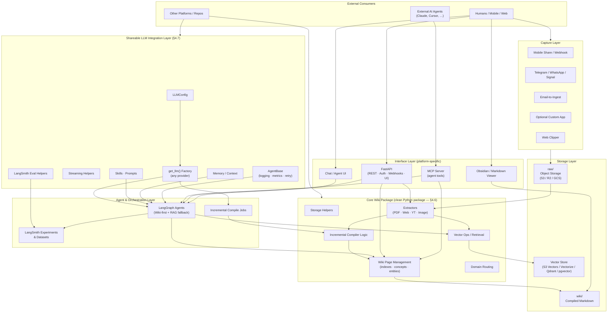
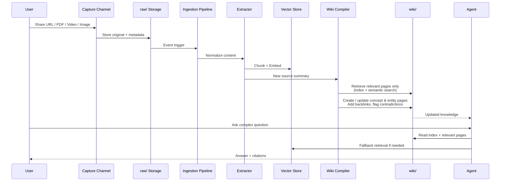

# LLM Wiki Knowledge Base — Design Document

**Version:** 1.5  
**Date:** 2026-09-05  
**Status:** Draft for team evaluation  
**Purpose:** Cost-effective, cloud-hosted, multimodal research knowledge base inspired by Andrej Karpathy’s LLM Wiki pattern, scaled for large volumes of PDFs, websites, blogs, YouTube videos, papers, images, and webpages.  
**Updates:**  
- 1.1: Added Section 4.6 on service interface / framework choice for sharability.  
- 1.2: Expanded Section 4.6 with a detailed multi-dimension comparison table (MCP vs FastAPI vs Python package vs Hybrid).  
- 1.3: Added Section 4.7 — Shareable LLM Integration Layer (inspired by AgentBase pattern), packaging strategy for cross-repo reuse, LangChain/LangGraph + LangSmith alignment.  
- 1.4: Redesigned Architecture Diagram to clearly separate Core Wiki Package, Shareable LLM Layer, Processing, and Interface layers (aligns with 4.6 Hybrid + 4.7).  
- 1.5: Added Section 4.8 — Application-Specific LLM Routing (multi-provider credentials + per-op model routing, deliberately kept *outside* §4.7's shareable, stable `LLMConfig` contract) and Agent Skill Invocation (the five compiler/query prompts become real SKILL.md-format files; the query agent — not the compiler — gains genuine runtime skill selection). Implementation detail in `implement-plan-v1.4.md` §19.

---

## 1. Goals & Design Principles

- Preserve the core Karpathy idea: **immutable raw sources** + **LLM-compiled, interlinked markdown wiki** that compounds knowledge over time.
- Support **very large** multimodal research corpora.
- Prioritize **cost-effectiveness**, low operational overhead, and incremental growth.
- Make mobile capture frictionless.
- Keep the wiki human-readable and inspectable (Obsidian-friendly).
- Hybrid approach: Wiki for synthesis + vector retrieval for scale.

**Non-goals (v1):** Full enterprise multi-tenancy, real-time collaborative editing, or heavy fine-tuning.

---

## 2. High-Level Architecture

The architecture deliberately separates **shareable packages** from **platform-specific services**. Two reusable Python packages sit at the center; everything else is either storage, processing, or interface.



### Layer Responsibilities (matching labels)

| Layer | Package / Component | Shareable? | Responsibility |
|-------|---------------------|------------|----------------|
| **Capture** | Webhooks, bots, share targets | Platform-specific | Land sources into `raw/` |
| **Storage** | Object storage + vector store | Infra | Immutable raw + compiled wiki + embeddings |
| **Core Wiki Package** (§4.6) | Clean Python package | **Yes — versioned package** | Storage helpers, extractors, vector ops, page management, incremental compiler, domain routing |
| **Shareable LLM Layer** (§4.7) | `llmwiki-llm` (or equivalent) | **Yes — independent package** | Provider factory, streaming, skills/prompts, memory/context, AgentBase, LangSmith eval helpers |
| **Agent & Orchestration** | LangGraph agents + compile jobs | Uses both packages | Wiki-first reasoning, multi-step compile, evaluation experiments |
| **Interface** | FastAPI + MCP Server | Platform-specific | REST, auth, webhooks, agent tools, UIs |

**Key packaging insight (Hybrid from §4.6 + §4.7):**  
- **Core Wiki Package** and **Shareable LLM Layer** are the two reusable Python packages.  
- Other platforms/repos can depend on either or both without pulling the FastAPI/MCP service.  
- The LLM Wiki service itself is one consumer of both packages.

---

## 3. Workflow & Data Flow

### 3.1 End-to-End Ingest → Compile → Query Flow



### 3.2 Data Flow Summary

| Stage              | Input                          | Output                          | Storage          |
|--------------------|--------------------------------|---------------------------------|------------------|
| Capture            | URL, file, voice, text         | Original + light metadata       | `raw/`           |
| Extraction         | Raw file / URL                 | Clean text / transcript / caption | `raw/` + temp   |
| Embedding          | Chunks                         | Vectors + metadata              | Vector store     |
| Compilation        | New source + relevant wiki pages | Updated / new markdown pages   | `wiki/`          |
| Query              | User question                  | Answer + sources                | Transient        |

---

## 4. Key Design Options (for later evaluation)

### 4.1 Capture / Mobile Ingest Channels

| Option                    | Description                                      | Pros                              | Cons                              | When to Prefer                  |
|---------------------------|--------------------------------------------------|-----------------------------------|-----------------------------------|---------------------------------|
| **Messaging (Hermes-style)** | Telegram Bot + WhatsApp + Signal as primary channel | Zero new app, very low friction, fast to build, multi-platform | Platform limits, less UI control | Personal / early stage, speed priority |
| **Webhook + Share Sheet** | Simple authenticated endpoint + iOS Shortcuts / Android Intent | Lightweight, works with system share | Requires some user setup          | Quick win alongside messaging   |
| **Email-to-Ingest**       | Dedicated address for forwards / attachments     | Universal, works from any app     | Parsing overhead, spam risk       | Secondary channel               |
| **Custom Mobile App**     | Native / Flutter / RN app in Share Sheet         | Full UX control, rich metadata, offline queue | High build & maintenance cost     | Productized offering, many users |
| **Hybrid**                | Messaging + Webhook + optional light PWA/App     | Best of both                      | Slightly more surface area        | Recommended default             |

**Recommendation for evaluation:** Start with Telegram (primary) + webhook/email. Add custom app only if messaging UX becomes a clear bottleneck.

### 4.2 Vector Store & Retrieval

| Option              | Cost Profile          | Scale          | Ops Effort | Notes                              |
|---------------------|-----------------------|----------------|------------|------------------------------------|
| Amazon S3 Vectors   | Very low (pay-per-use)| Billions       | Minimal    | Strong integration with Bedrock    |
| Cloudflare Vectorize + R2 | Extremely low     | High           | Minimal    | Excellent for edge / low fixed cost|
| Qdrant (Cloud or self-host) | Low–medium       | High           | Low–medium | Good hybrid search                 |
| pgvector            | Low (if already on Postgres) | Medium   | Low        | Simple if relational data exists   |
| Fully managed (Bedrock KB, etc.) | Medium–higher | High       | Very low   | Fastest to production              |

### 4.3 LLM Strategy

| Approach                  | Use Case                          | Cost Impact      | Quality          |
|---------------------------|-----------------------------------|------------------|------------------|
| Cloud only (Haiku / Flash / mini + stronger) | All stages                    | Predictable, can grow | High             |
| Local open-source (Ollama / vLLM) for bulk | Embeddings, extraction, draft compile, simple Q&A | Large savings on volume | Good for routine |
| Hybrid routing            | Local for bulk, cloud for complex synthesis | Best cost/quality balance | Highest          |

Local models (Qwen3 8B/14B class, Llama 3.1/3.3 8B, strong embeddings) can cut the dominant token bill significantly once volume grows.

### 4.4 Compilation Strategy (Avoid Full Wiki Scans)

- Hierarchical indexes + one-line page gists (progressive disclosure).
- Semantic retrieval of only relevant wiki pages before compilation.
- Delta / incremental updates (create or patch affected pages only).
- Two-phase plan-then-generate (cheap model plans, stronger model executes).
- Scheduled global lint / synthesis jobs (not on every ingest).

### 4.5 Storage

- Primary: Object storage (S3 / R2 / GCS) for both `raw/` and `wiki/`.
- Optional: Git-backed or database for the active wiki if versioning / collaboration is needed later.
- Lifecycle policies for cold raw data.

### 4.6 Service Interface & Framework Choice (Sharability)

Making the knowledge base **sharable** (personal use → small team → multi-user platform) requires a clear decision on how the service is exposed. Three main options were evaluated in detail:

#### Detailed Framework Comparison

| Dimension                        | **MCP Server** (Model Context Protocol)                                                                 | **FastAPI Server**                                                                 | **Python Package / Library**                                                      | **Hybrid (Recommended)**                                      |
|----------------------------------|---------------------------------------------------------------------------------------------------------|------------------------------------------------------------------------------------|-----------------------------------------------------------------------------------|---------------------------------------------------------------|
| **Primary consumer**            | AI agents (Claude Desktop, Cursor, Windsurf, custom agents)                                            | Humans, web UIs, mobile apps, scripts, other backend services                     | Developers who import and call the code directly                                 | Both agents **and** humans/services                           |
| **Discovery mechanism**         | Automatic — agent reads tool schemas & descriptions at connect time                                    | Manual — OpenAPI / Swagger docs or hand-written client code                       | Code-level (import + read docstrings / type hints)                               | Agents via MCP; humans via OpenAPI                            |
| **Integration effort for AI**   | Very low (“add this server”)                                                                           | High (custom tool wrappers needed)                                                | Medium–high (must write glue code)                                               | Very low for agents                                           |
| **Integration effort for humans / apps** | High (need extra UI or bridge)                                                                    | Low–medium (standard HTTP)                                                        | High (must build own interface)                                                  | Low (use the FastAPI layer)                                   |
| **Auth & multi-tenancy**        | Possible but less mature; often custom or limited                                                      | Excellent — OAuth2, JWT, API keys, workspaces, RBAC, row-level security           | You implement everything yourself                                                | Excellent (via FastAPI)                                       |
| **Web UI / dashboards**         | Weak — requires separate front-end                                                                     | Strong — easy to serve React, Streamlit, or custom UI from same process           | None by default                                                                  | Strong                                                        |
| **File upload / webhooks**      | Possible but awkward                                                                                   | Native and straightforward                                                        | Not applicable                                                                   | Native via FastAPI                                            |
| **Tool / endpoint style**       | Structured tools with JSON schema (ideal for LLM tool-calling)                                         | REST endpoints + OpenAPI                                                          | Python functions / classes                                                       | Both (same core functions exposed two ways)                   |
| **Local vs remote use**         | Excellent for both (stdio for local, HTTP/SSE for remote)                                              | Primarily remote (can also run locally)                                           | Purely local / embedded                                                          | Excellent for both                                            |
| **Deployment complexity**       | Low–medium (stdio process or lightweight HTTP server)                                                  | Medium (standard ASGI server + optional reverse proxy)                            | Lowest (just a library)                                                          | Medium (one FastAPI process that also serves MCP)             |
| **Observability & logging**     | Good when using HTTP transport; harder with pure stdio                                                 | Excellent (middleware, structured logging, metrics)                               | Depends on the caller                                                            | Excellent                                                     |
| **Performance overhead**        | Low–medium (JSON-RPC + possible extra hop)                                                             | Low                                                                                | Lowest (direct function calls)                                                   | Low–medium                                                    |
| **Ecosystem maturity (2026)**   | Rapidly growing; many RAG/KB MCP servers exist; FastMCP well maintained                               | Very mature, huge community, excellent docs                                       | Standard Python packaging                                                        | Best of both worlds                                           |
| **Multi-user / team sharing**   | Possible but usually one agent config per user or shared server with limited isolation                | First-class (workspaces, permissions, quotas)                                     | Poor without additional server layer                                             | First-class                                                   |
| **Mobile capture integration**  | Indirect (bot or webhook still needed)                                                                 | Direct (webhook endpoints, signed upload URLs)                                    | Not applicable                                                                   | Direct via FastAPI                                            |
| **Long-term maintainability**   | Good if tools stay stable; protocol still evolving                                                     | Excellent                                                                          | Excellent for core logic                                                         | Excellent                                                     |
| **Best fit phase**              | Phase 0 – early Phase 1 (personal / agent-first)                                                       | Phase 1 – Phase 3 (team → product)                                                | All phases (as the shared core)                                                  | All phases (recommended path)                                 |
| **Typical tools exposed**       | `search_wiki`, `get_page`, `ingest_source`, `compile_update`, `list_concepts`, `lint_wiki`             | Same capabilities + `/upload`, `/webhooks/ingest`, `/auth`, admin endpoints       | Same functions callable in Python                                                | All of the above                                              |

#### Recommended Approach: Hybrid  
*(See Architecture Diagram in §2 — boxes labeled **Core Wiki Package** and **Interface Layer**.)*

1. **Core logic as a clean Python package** (`Core Wiki Package` in the diagram)  
   All important pieces live here: storage helpers, extractors, incremental compiler, vector retrieval, wiki page management, domain routing, etc.  
   This keeps the “brain” reusable, testable, and importable by scripts, notebooks, CLI tools, or other services.  
   **It is deliberately separate from the FastAPI/MCP service** so other platforms can depend on it without pulling the whole server.

2. **Expose primarily through FastAPI** (`Interface Layer` in the diagram)  
   Provides a proper REST API, authentication, multi-user/workspace support, file upload endpoints, webhooks for mobile capture, and an easy place to host a simple web UI or markdown viewer.  
   This supports the full growth path from personal use to team to productized offering.

3. **Add an MCP server layer on top** (also in `Interface Layer`)  
   Convert the same core functions / FastAPI routes into MCP tools.  
   Agents can then connect with almost zero integration effort and use tools such as `search_wiki`, `get_page`, `ingest_source`, `compile_update`, `list_concepts`, etc.  
   FastMCP offers solid `from_fastapi()` support and can also mount an MCP server inside a FastAPI app, so both interfaces can live in one process.

#### Why this combination wins

- **MCP alone** is excellent for agent-first / personal use but becomes limiting when you need proper multi-user auth, a web front-end, file upload webhooks, or non-AI clients.
- **FastAPI alone** forces every AI tool (Claude, Cursor, etc.) to write custom integration code instead of simply connecting.
- **A pure package** is highly valuable as the shared core but does not make the system “connect and use” for other people or agents.
- **FastAPI + MCP (with shared Python core)** gives both human and agent access with the least long-term technical debt. This pattern is already common among successful knowledge-base projects in 2026.

#### Suggested evolution across phases

| Phase   | Framework focus                                      | Notes                                      |
|---------|------------------------------------------------------|--------------------------------------------|
| **0**   | Python package + simple MCP server (or light FastAPI + MCP) | Fastest path to a usable agent-connected system |
| **1**   | Full FastAPI service + MCP layer + basic auth        | Enables small-team sharing and mobile webhooks |
| **2+**  | Multi-tenant FastAPI + richer MCP tools              | Ready for broader use and optional custom app |

### 4.7 Shareable LLM Integration Layer

*(See Architecture Diagram in §2 — box labeled **Shareable LLM Integration Layer** and the Layer Responsibilities table.)*

This section designs a reusable Python layer that abstracts LLM access, prompts, skills, memory/context, and evaluation. It is inspired by the `AgentBase` / `AgentConfig` pattern used in other projects and is intended to be **shared across repositories and platforms**.

#### Goals of the LLM Layer

1. **Provider-agnostic** — freely map any existing LLM (OpenAI, Anthropic, Google, NVIDIA, DeepSeek, OpenRouter, local llama.cpp / Ollama / vLLM, etc.) through a single factory.
2. **Eval- and tuning-ready** — first-class support for prompts, skills, memory/context windows, and LangSmith datasets / experiments.
3. **Built on LangChain / LangGraph** — use them as the base framework for models, tools, graphs, and callbacks.
4. **Shareable** — package so multiple platforms and repos can depend on the same stable LLM abstraction without forking.

#### Proposed Package Structure

```
llmwiki_llm/                    # or a more neutral name e.g. fund_llm / agent_llm_core
├── pyproject.toml
├── README.md
├── llmwiki_llm/
│   ├── __init__.py
│   ├── config.py               # LLMConfig (env-driven, dataclass)
│   ├── factory.py              # get_llm() — provider mapping
│   ├── streaming.py            # astream_collect and related helpers
│   ├── callbacks.py            # TokensPerSecondHandler, LangSmith-ready handlers
│   ├── prompts.py              # Prompt registry / versioned prompt loading
│   ├── skills.py               # Skill scanning, load_skill tool, skills context
│   ├── memory.py               # Working memory + optional persistent memory interface
│   ├── context.py              # Context window management, message truncation
│   ├── agent_base.py           # Lightweight AgentBase (logging, metrics, retry, lifecycle)
│   └── eval/
│       ├── __init__.py
│       ├── datasets.py         # Helpers to push examples to LangSmith datasets
│       └── runners.py          # Thin wrappers around langsmith.evaluate / aevaluate
└── tests/
```

#### Core Design Inspired by `agent_base.py`

| Component              | Responsibility                                                                 | Notes |
|------------------------|---------------------------------------------------------------------------------|-------|
| **LLMConfig**          | Env-driven configuration (provider, model, keys, temperature, max_tokens, timeouts, base_url) | Same spirit as `AgentConfig`; keep it free of wiki-specific concerns |
| **get_llm()**          | Factory that returns a LangChain chat model for any supported provider         | Extensible; new providers added in one place |
| **astream_collect**    | Stream + accumulate helper so timeouts stay scoped to inactivity gaps          | Directly reusable from the example |
| **TokensPerSecondHandler** + other callbacks | Observability (TPS, token counts); can also emit to LangSmith or internal storage | Keep side-effects pluggable |
| **Skills**             | Scan a skills directory, build context string, expose `load_skill` tool         | Enables prompt/skill tuning without code changes |
| **Memory / Context**   | Working memory (dict) + optional persistent backend; context window helpers    | Separate from the wiki’s long-term knowledge |
| **AgentBase**          | Logging, metrics, retry, lifecycle hooks, skills loading                       | Thin base that wiki agents (and other platforms) can inherit or compose |
| **Eval helpers**       | Create LangSmith datasets from traces or curated examples; run experiments     | Makes continuous evaluation a first-class citizen |

The layer **does not** own wiki storage, vector indexes, or compilation logic. Those stay in the main `llmwiki` core package. The LLM layer only knows how to talk to models, manage prompts/skills/context, and support evaluation.

#### How to Package for Sharing Across Platforms / Repos

**Recommended packaging strategy:**

1. **Independent installable package**  
   Publish as a proper Python package (private PyPI, GitHub Packages, or internal Artifactory).  
   Name examples: `llmwiki-llm`, `fund-llm-core`, `agent-llm-kit`.  
   Other repos declare a dependency: `llmwiki-llm>=0.x`.

2. **Strict separation of concerns**  
   - No dependency on the wiki storage, FastAPI app, or MCP server.  
   - Only depends on `langchain-core`, provider packages (optional extras), and optionally `langsmith`.  
   - Wiki-specific agents live in the main repo and *import* this package.

3. **Extras for optional providers**  
   ```toml
   [project.optional-dependencies]
   openai = ["langchain-openai"]
   anthropic = ["langchain-anthropic"]
   google = ["langchain-google-genai"]
   local = ["langchain-community"]          # or specific local bindings
   langsmith = ["langsmith"]
   all = ["llmwiki-llm[openai,anthropic,google,local,langsmith]"]
   ```

4. **Versioning & stability contract**  
   - Semantic versioning.  
   - Treat `LLMConfig`, `get_llm()`, and the public AgentBase surface as the stable API.  
   - Document provider matrix and any breaking changes clearly.

5. **Monorepo vs multi-repo options**  
   - **Preferred for sharing:** separate small repo (or a clearly isolated package inside a monorepo) that is published and versioned independently.  
   - Alternative: path dependency / git submodule during early development, then graduate to a published package once the API stabilizes.

6. **Configuration injection**  
   - Config remains env-driven or explicitly passed.  
   - Platforms can supply their own `LLMConfig` instances or override via environment.  
   - No hard-coded secrets or platform-specific URLs inside the package.

7. **Testing & CI**  
   - Unit tests for factory, streaming helper, skills loading, and masking.  
   - Optional integration tests that skip if API keys are absent.  
   - Consumers can run the same tests against their provider matrix.

#### Alignment with LangChain / LangGraph / LangSmith

- **Models** — always return LangChain `BaseChatModel` instances so they plug directly into LangGraph nodes and tool-calling.  
- **Tools / Skills** — skills are exposed as LangChain tools; the load_skill pattern works inside LangGraph ToolNodes.  
- **Graphs** — wiki agents built with LangGraph import `get_llm()` and the skill/memory helpers from this package.  
- **Evaluation** — the `eval/` subpackage provides thin helpers that create LangSmith datasets and run experiments; production traces can be promoted into datasets for regression testing of compile quality, citation fidelity, and multi-hop answers.  
- **Callbacks** — the TPS / usage handlers can be composed with LangSmith tracers so both internal metrics and LangSmith traces are captured.

#### Relationship to the Rest of the Design

```
┌─────────────────────────────────────────────────────────┐
│  Platforms / other repos                                 │
│  (wiki service, other agents, notebooks, CLIs)           │
└─────────────────────┬───────────────────────────────────┘
                      │ depends on
                      ▼
┌─────────────────────────────────────────────────────────┐
│  llmwiki-llm  (this shareable package)                   │
│  Config · Factory · Streaming · Callbacks · Skills ·     │
│  Memory/Context · AgentBase · LangSmith eval helpers     │
└─────────────────────┬───────────────────────────────────┘
                      │ uses
                      ▼
┌─────────────────────────────────────────────────────────┐
│  LangChain / LangGraph / LangSmith + provider SDKs       │
└─────────────────────────────────────────────────────────┘
```

The main LLM Wiki service (FastAPI + MCP + core wiki logic) becomes one consumer of `llmwiki-llm`. Other internal platforms can consume the same package without pulling in wiki-specific code.

#### Open Decisions for the Team

- Exact package name and whether it lives in its own repository from day one.  
- Which providers are in the default vs optional extras.  
- How aggressive to be with LangSmith as a hard vs soft dependency.  
- Whether AgentBase should be a class to inherit or a set of composable mixins/helpers.

### 4.8 Application-Specific LLM Routing & Agent Skill Invocation

*(New in 1.5. Implementation detail lives in `implement-plan-v1.4.md` §19 — this section states the
architectural decision and where its boundary sits relative to §4.7.)*

§4.7's `LLMConfig` is deliberately a **single provider, single model, single credential** shape —
that simplicity is what makes it a crisp, semver-protected contract other repositories (FUND) can
depend on. Real deployments of *this* service want more: several providers configured at once, and a
different model per pipeline stage (a cheap model for `plan_compile`, a stronger one for
`create_page`/`patch_page`). That richer shape does not belong in the shareable contract — it is a
concern of the application wiring this particular service together, not of the LLM layer other
repositories import.

#### 4.8.1 Multi-Provider, Per-Op Routing

- A repo-root `config/` directory — **outside `src/llmwiki`, not part of the installable package** —
  holds two plain, committed Python modules:
  - `config/providers.py`: which providers are available and which environment variable names carry
    each one's credentials (`{"provider": "openai", "api_key_env": "OPENAI_API_KEY", ...}`). It holds
    **no secret values** — only env-var *names* — so it is ordinary committed config, not a `.env`
    twin. A provider whose named env var is unset/empty at startup is simply absent from the *active*
    provider set (not an error).
  - `config/ops.py`: one row per operation name the codebase already calls (`answer_query`,
    `summarize_source`, `plan_compile`, `create_page`, `patch_page`), each naming its provider, model,
    temperature and token cap. An op naming an inactive/undefined provider, or a known op missing a
    row, fails loudly at startup — the same "fail by name" posture as `Settings.require` today.
- This retires `COMPILE_EXECUTOR_MODEL`: the "stronger model for patches" idea it encoded becomes
  nothing more than `create_page`/`patch_page` having their own rows in `config/ops.py`.
- **Zero-config behavior is unchanged.** When `config/providers.py` is absent, the service falls back
  to exactly today's single-provider path driven by `Settings` — this is what keeps a fresh clone,
  CI, and the offline smoke flow working with no setup.
- This layer is explicitly **not** promoted into §4.7's shareable package. If a future consumer wants
  multi-provider routing, that is a new, separate evaluation against the stability contract in
  implement-plan-v1.4.md §7.3 — not an automatic graduation of this app's `config/`.

#### 4.8.2 SKILL.md-Format Prompts & Query-Agent Skill Invocation

- The prompt files under `chains/prompts/*.md` (one per op, §4.4) gain real YAML frontmatter
  (`name`, `description`) so each is independently a valid Agent Skill, discoverable by an external
  harness (Claude Code, the Claude Agent SDK, an MCP client) — not only by this codebase's own loader.
- The four **compiler** stages keep the deterministic, fixed op→prompt mapping unchanged — this is
  what §4.4's cost-bounded, non-agentic compilation guarantee depends on, and it is not weakened here.
- The **query agent** (only) gains a genuine skill-invocation capability: rather than always loading
  `answer_query.md`, it is given the discovered skill set and picks — and can chain — among them per
  question, via a real tool-use round trip with the model. This is a scoped, early pull-forward of
  what §4.7's `Skills` component and the existing plan's `SKILLS_DIR` (implement-plan-v1.4.md §14,
  milestone N6) eventually generalize — done now, narrowly, for one agent, without waiting on N4/N6's
  FUND-adoption gate and without generalizing skills/memory/`AgentBase` speculatively ahead of a real
  second consumer (the same anti-speculative-generality reasoning implement-plan-v1.4.md §12.1 already
  applies to N6).

See §5 for the phase placement of this last piece.

---

## 5. Multi-Phase Growth Plan

Phases are driven by corpus size, user count, query volume, and feature demand.

### Phase 0 — Foundation (Personal / Prototype)
**Goal:** Working end-to-end system for one researcher.  
**Scope:**
- Object storage (`raw/` + `wiki/`).
- Telegram bot (or webhook) as primary capture.
- Basic extraction (PDF, web, YouTube transcript).
- Simple vector store + hybrid retrieval.
- Incremental wiki compiler with hierarchical index.
- Core wiki logic as Python package.
- **Shareable LLM integration layer** (Section 4.7) with provider factory + basic AgentBase.
- Simple MCP server (and/or lightweight FastAPI) exposing the key tools.
- Obsidian or simple markdown viewer + agent chat.
- Cloud cheap models only; LangSmith tracing optional.
- **Application-specific multi-provider/per-op LLM routing** (Section 4.8.1) — deliberately kept
  outside the shareable layer above.
- **Scoped exception:** the query agent (only) gets real skill invocation over SKILL.md-format
  prompts (Section 4.8.2) — a narrow slice of the Phase 1 "better agent tools" item below, pulled
  forward because it was explicitly requested, not because Phase 0 otherwise needs agentic tool use.

**Success criteria:** Daily capture works; wiki compounds usefully; cost stays very low; agents can connect via MCP; LLM layer is importable by other code.

### Phase 1 — Reliable Personal / Small Team
**Goal:** Stable daily driver, better mobile capture, cost control.  
**Add:**
- WhatsApp / Signal / email channels.
- Improved extraction quality and deduplication.
- Local LLM option for embeddings + routine compilation (via the shared LLM layer).
- Better agent tools and citation quality (LangGraph agents using the LLM layer).
- Basic monitoring and lint jobs.
- Optional light PWA for share-target.
- Full FastAPI service + MCP layer with basic auth (per Section 4.6 hybrid recommendation).
- First LangSmith datasets for answer quality and compile correctness.

**Success criteria:** Multiple users can capture reliably; per-ingest cost stays proportional to relevance; both human API and agent MCP access work cleanly; LLM layer is versioned and reusable.

### Phase 2 — Scaled Research Platform
**Goal:** Support large corpora and moderate concurrent use.  
**Add:**
- Domain partitioning of the wiki.
- Stronger hybrid search + reranking.
- Selective multimodal (image / page-as-image) handling.
- Automated domain routing and higher-quality synthesis.
- Usage dashboards and cost alerts.
- Optional custom mobile app if messaging friction is proven.

**Success criteria:** Corpus can grow to hundreds of thousands of chunks without linear cost explosion; wiki remains navigable.

### Phase 3 — Productized / Multi-User
**Goal:** Multi-tenant or team product with polished experience.  
**Add:**
- Proper auth, workspaces, permissions.
- Full custom mobile app (if justified).
- Advanced evaluation, feedback loops, human-in-the-loop review.
- Optional fine-tuning / synthetic data on core wiki content.
- Enterprise connectors or managed offering.

**Success criteria:** Clear product-market fit signals; unit economics remain healthy.

---

## 6. Cost Philosophy (High-Level)

- Storage and vector layer: prefer pay-as-you-go object-storage-native options.
- LLM spend: the main variable. Attack it with local models for bulk work + smart routing + aggressive caching + incremental compilation.
- Capture and orchestration: serverless / event-driven to keep fixed costs near zero.
- Target: stay in the low-to-mid hundreds of dollars per month even at serious research scale; far lower for personal use.

Exact numbers depend on volume and model mix — to be measured in Phase 0/1.

---

## 7. Open Questions for Team Evaluation

1. Primary capture preference: messaging-first vs early investment in custom app?
2. Preferred cloud provider / vector store (AWS S3 Vectors, Cloudflare, self-hosted, managed)?
3. Appetite for running local / GPU inference early vs pure cloud?
4. How important is full Obsidian compatibility vs a dedicated web UI?
5. Multi-user / sharing requirements in the first 6–12 months?
6. Acceptable latency for compilation after a new source arrives?
7. **Framework priority**: Start MCP-first (agent-native) or FastAPI-first (human + API), or commit early to the hybrid Python-package + FastAPI + MCP approach recommended in Section 4.6?
8. **LLM layer packaging**: Own repo + published package from day one, or start as an internal module and extract later? Preferred package name?
9. Which LLM providers must be in the first release of the shareable LLM layer vs optional extras?
10. How strongly to couple LangSmith (hard dependency vs optional extra) for evaluation?

---

## 8. Next Steps After Evaluation

1. Choose Phase 0 stack (capture channel + storage + vector + LLM routing + service interface).
2. Decide on the service framework direction (MCP-first, FastAPI-first, or hybrid as recommended in 4.6).
3. Decide packaging approach for the shareable LLM integration layer (Section 4.7).
4. Implement thin vertical slice: one capture method → raw → extract → embed → incremental compile → query, using the LLM layer and exposed via the chosen interface(s).
5. Measure real costs and quality on a representative research corpus; stand up first LangSmith datasets.
6. Decide Phase 1 priorities based on data.

---

**Document maintained as living Markdown.**  
Update version and date when major decisions are locked.

---

*End of Design Document*
